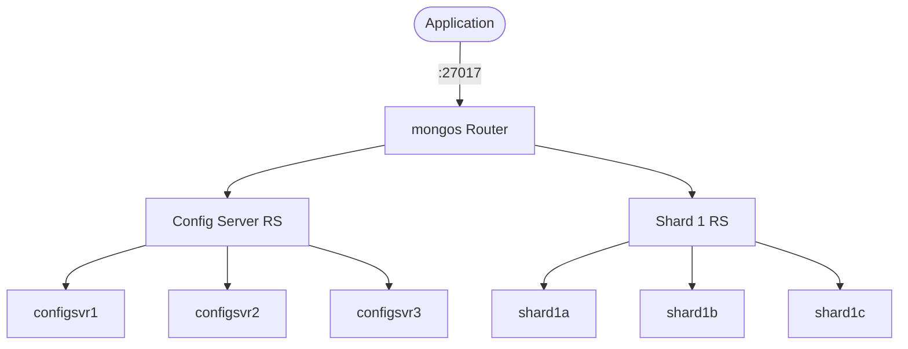

# MongoDB Sharding Cluster

A full MongoDB sharded cluster for local development and testing.  
Includes config servers, a shard replica set, a mongos router, and automatic initialization.

## How MongoDB Sharding works



1. **mongos** is the query router — applications connect here on port 27017.
2. **Config Server RS** (3 nodes) stores cluster metadata, chunk mappings, and shard topology.
3. **Shard 1 RS** (3 nodes) stores the actual data, distributed across chunks.
4. The **init** container automatically initializes all replica sets, adds the shard, and enables sharding on `appdb`.

## Stack details in this repo

- Image: `mongo:7`
- Services: `configsvr1-3`, `shard1a-c`, `mongos`, `init`
- Router port: `27017` (mongos)
- Replica sets:
  - `csrs` — config servers
  - `shard1` — data shard
- Persistent data:
  - `cfg1`, `cfg2`, `cfg3` — config server volumes
  - `s1a`, `s1b`, `s1c` — shard volumes

## How to run

From the repository root:

```bash
cd mongodb-sharding-cluster
docker compose up -d
```

Wait ~15 seconds for initialization, then connect to the router:

```bash
mongosh "mongodb://localhost:27017"
```

Verify the cluster:

```bash
mongosh --host localhost:27017 --eval "sh.status()" --quiet
```

Useful commands:

```bash
docker compose ps
docker compose logs -f init
docker compose logs -f mongos
docker compose down
```

## Use it effectively

- Connect applications to `mongos` on port `27017` — it routes queries to the correct shard.
- Shard a collection:

```bash
mongosh --host localhost:27017 --eval '
  use appdb
  sh.shardCollection("appdb.users", { _id: "hashed" })
'
```

- Add more shards by adding `shard2a/b/c` services and running `sh.addShard(...)`.
- Monitor chunk distribution with `sh.status()`.
- Test balancer behavior by inserting large datasets.

## Architecture

| Component      | Role             | Replica Set | Nodes     |
| -------------- | ---------------- | ----------- | --------- |
| Config Servers | Cluster metadata | `csrs`      | 3         |
| Shard 1        | Data storage     | `shard1`    | 3         |
| mongos         | Query router     | —           | 1         |
| init           | One-time setup   | —           | 1 (exits) |

## Notes

- The `init` container runs once and exits — this is expected.
- All services must be running before `init` can succeed (it waits 10 seconds).
- No authentication is configured by default; add `--keyFile` for production.
- To add a second shard, duplicate the `shard1a/b/c` pattern as `shard2a/b/c` with a new replica set name.
- For host access, `mongos` is exposed on `localhost:27017` — no hosts file changes needed since the router handles routing internally.

## Sharding Cluster vs Replica Set

| Feature                | Sharding Cluster                              | Replica Set                                |
| ---------------------- | --------------------------------------------- | ------------------------------------------ |
| Purpose                | Horizontal scaling & data distribution        | High availability & failover               |
| Nodes                  | 7+ (config servers + shard nodes + router)    | 3 (1 primary + 2 secondaries)              |
| Data distribution      | Data split across shards by shard key         | All nodes hold the same data               |
| Write scaling          | Writes distributed across shard primaries     | Single primary handles all writes          |
| Read scaling           | Reads routed to relevant shard                | Read from secondaries with read preference |
| Failover               | Per-shard automatic failover                  | Automatic (secondary promoted to primary)  |
| Use case               | Large datasets, high throughput, multi-tenant | Most applications, moderate traffic        |
| Complexity             | High                                          | Low                                        |
| Connection             | Always through mongos router                  | Direct to any node or replica set URI      |
| Minimum for production | 9+ nodes (config RS + shard RS + mongos)      | 3 nodes                                    |

**When to use Sharding:** Your data or write throughput exceeds what a single replica set can handle, or you need geographic data distribution.

**When to use Replica Set:** Your data fits on a single server and you need redundancy and automatic failover.

See also: [mongodb-replicaset](../mongodb-replicaset)
