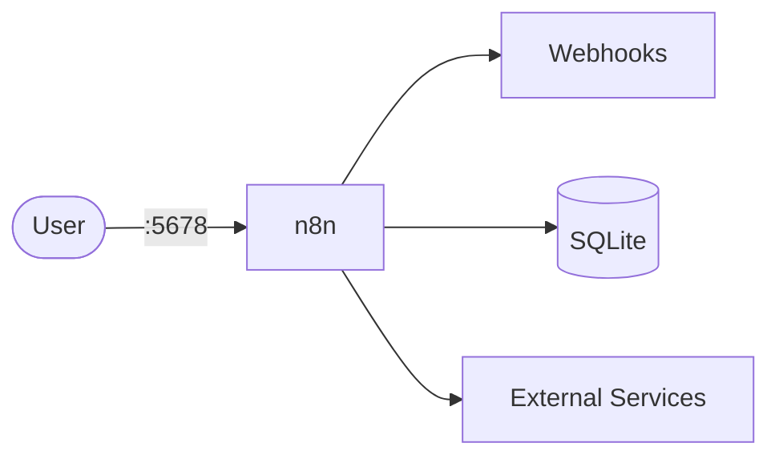

# n8n

This stack runs n8n using local persistent storage (SQLite-based default setup).  
It is simple to run for local automation and testing workflows.

## How it works



1. n8n container starts and loads config from environment variables.
2. Workflow/editor service is exposed on port `5678`.
3. Data is persisted in mounted n8n storage volume.
4. URL/proxy settings control webhook and editor endpoints.

## Stack details in this repo

- Image: `docker.n8n.io/n8nio/n8n:latest`
- Container name: `n8n`
- UI/API: `http://<host-ip>:5678`
- Persistent data:
  - `data:/root/.n8n`

## Environment variables

Copy `.env.example` to `.env` and update values:

- `TZ`, `DB_SQLITE_POOL_SIZE`
- `N8N_*` workflow/security/URL settings
- `WEBHOOK_URL`

## How to run

From the repository root:

```bash
cd n8n
cp .env.example .env
docker compose up -d
```

Open:

- `http://localhost:5678`

Useful commands:

```bash
docker compose ps
docker compose logs -f
docker compose restart
docker compose down
```

## Notes

- For production-grade reliability, prefer the `n8n+postgresql` stack.
- Keep webhook/editor URLs aligned with your public domain/proxy settings.
