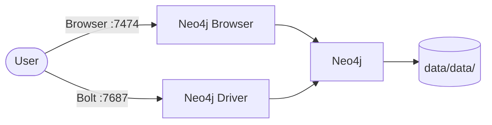
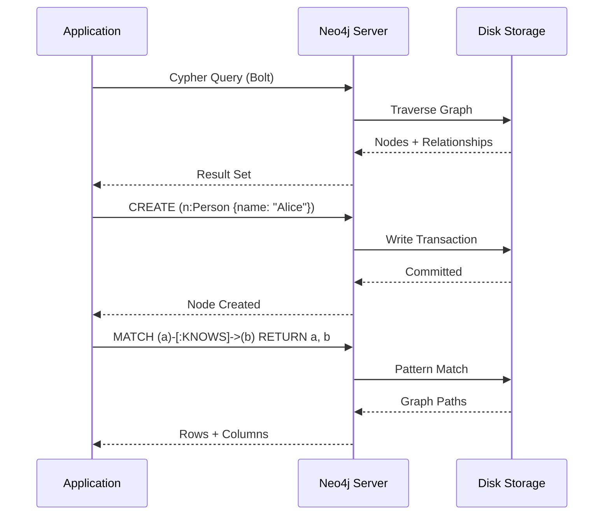

# Neo4j

Neo4j is a native graph database that stores data as nodes, relationships, and properties.  
It uses the Cypher query language and is widely used for connected data — knowledge graphs, recommendation engines, fraud detection, and AI graph reasoning.

## How it works





1. Applications connect to Neo4j via the **Bolt protocol** (port `7687`) using official drivers for JavaScript, Python, Java, .NET, and more.
2. The **Neo4j Browser** (port `7474`) provides a web-based Cypher editor with graph visualization.
3. Data is stored as nodes connected by labeled relationships, each with key-value properties.
4. Queries use **Cypher**, a declarative graph query language optimized for traversing relationships.

## Stack details in this repo

- Image: `neo4j:latest`
- Browser UI: `http://localhost:7474`
- Bolt API: `localhost:7687`
- Default credentials: `neo4j / password` (change via `.env`)
- Plugins enabled: APOC (Awesome Procedures on Cypher)
- Persistent data:
  - `./data/data/` — database files
  - `./data/logs/` — server logs
  - `./data/import/` — CSV/JSON import directory
  - `./data/plugins/` — additional plugin jars
  - `./data/conf/` — custom configuration

## Environment variables

Set via `.env`:

| Variable | Default | Description |
|----------|---------|-------------|
| `NEO4J_USER` | `neo4j` | Database username |
| `NEO4J_PASSWORD` | `password` | Database password |
| `PAGECACHE_SIZE` | `512M` | Memory for caching nodes/relationships |
| `HEAP_INITIAL_SIZE` | `512M` | Initial JVM heap size |
| `HEAP_MAX_SIZE` | `1G` | Maximum JVM heap size |

## How to run

From the repository root:

```bash
cd neo4j
docker compose up -d
```

Open the browser:

```text
http://localhost:7474
```

Useful commands:

```bash
docker compose ps
docker compose logs -f
docker compose down
docker compose down -v
```

## How to use

### Connect via Browser

1. Open `http://localhost:7474`
2. Connect with `neo4j` / `password`
3. Run Cypher queries interactively

### Create nodes and relationships

```cypher
CREATE (alice:Person {name: "Alice", age: 30})
CREATE (bob:Person {name: "Bob", age: 32})
CREATE (alice)-[:KNOWS {since: 2020}]->(bob)
```

### Query with graph traversal

```cypher
MATCH (p:Person)-[:KNOWS]->(friend)
WHERE p.name = "Alice"
RETURN p, friend
```

### Import CSV

Place your CSV in `./data/import/` and run:

```cypher
LOAD CSV WITH HEADERS FROM "file:///people.csv" AS row
CREATE (:Person {name: row.name, age: toInteger(row.age)})
```

### Use with Python

```python
from neo4j import GraphDatabase

driver = GraphDatabase.driver(
    "bolt://localhost:7687", auth=("neo4j", "password")
)
with driver.session() as session:
    result = session.run("MATCH (n) RETURN n.name AS name LIMIT 10")
    for record in result:
        print(record["name"])
```

## Notes

- Change the default password before exposing this stack outside local development.
- The `data/import/` folder is mounted to `/import` — files placed there are accessible with `file:///` in Cypher.
- APOC provides hundreds of procedures for data transformation, graph algorithms, and more.
- For AI use cases, Neo4j supports vector indexes and can store/query embeddings with `apoc.nlp.*` procedures.
