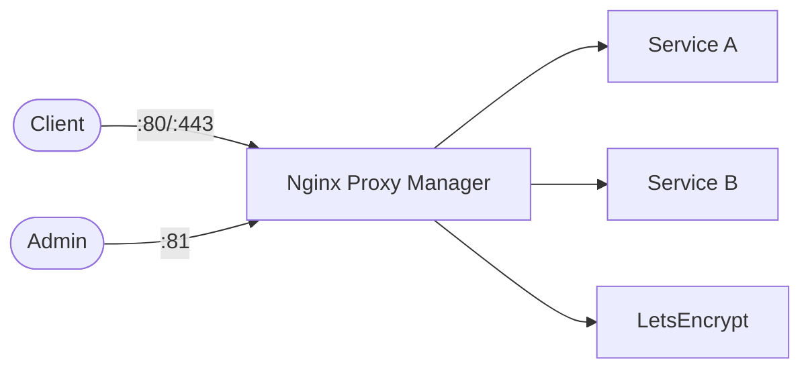

# Nginx Proxy Manager

Nginx Proxy Manager is a web-based reverse proxy manager for routing domains to internal services with optional SSL/TLS automation.

## How it works



1. Nginx Proxy Manager exposes HTTP/HTTPS entrypoints.
2. You configure proxy hosts from the admin UI.
3. Requests are routed to target services/containers.
4. LetsEncrypt certificates can be requested and renewed from the UI.

## Stack details in this repo

- Image: `jc21/nginx-proxy-manager:latest`
- Container name: `nginx-proxy-manager`
- Ports:
  - `80` (HTTP)
  - `443` (HTTPS)
  - `81` (Admin UI)
- Persistent data:
  - `./data:/data`
  - `./letsencrypt:/etc/letsencrypt`

## Environment variables

Copy `.env.example` to `.env`:

- `TZ`
- `NPM_HTTP_PORT`
- `NPM_HTTPS_PORT`
- `NPM_ADMIN_PORT`

## How to run

From the repository root:

```bash
cd nginx-proxy-manager
cp .env.example .env
docker compose up -d
```

If you use Podman:

```bash
cd nginx-proxy-manager
cp .env.example .env
podman compose up -d
```

Open admin UI:

- `http://localhost:81`

Default initial login:

- Email: `admin@example.com`
- Password: `changeme`

You will be prompted to change both on first login.

## Useful commands

```bash
docker compose ps
docker compose logs -f
docker compose restart
docker compose down
```

## Notes

- Port conflicts are common on `80`/`443`; change mapped ports in `.env` if needed.
- If you run this behind another reverse proxy, ensure correct forwarded headers.
