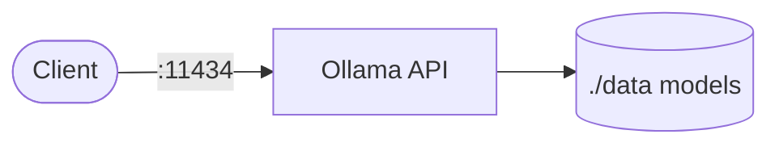

# Ollama

Ollama runs local large language models behind a simple HTTP API.  
This stack starts the Ollama server and persists downloaded models.

## How it works



1. `ollama serve` starts the inference API on port `11434`.
2. Models are stored in the mounted `./data` directory.
3. Clients call `/api/generate` or `/api/chat` to run prompts.
4. You can pull models inside the running container.

## Stack details in this repo

- Image: `ollama/ollama`
- Command: `serve`
- API endpoint: `http://<host-ip>:11434`
- Persistent data:
  - `./data:/root/.ollama`
- Network: `ollama_network`

## Environment variables

Set in compose directly:

- `OLLAMA_HOST=0.0.0.0:11434`
- `OLLAMA_MODELS=/root/.ollama/models`
- `OLLAMA_DATA=/root/.ollama`
- `OLLAMA_NO_CLOUD=true`
- `OLLAMA_NUM_PARALLEL`, `OLLAMA_MAX_QUEUE`, etc.

## How to run

From the repository root:

```bash
cd ollama
docker compose up -d
```

Pull a model:

```bash
docker exec -it ollama-ollama-1 /bin/sh
ollama pull llama3.2
```

Useful commands:

```bash
docker compose ps
docker compose logs -f
docker compose restart
docker compose down
```

## Notes

- First model pull can take time depending on model size.
- If container name differs in your environment, check with `docker ps` before `docker exec`.

## References

- Official site: <https://ollama.com>
- GitHub repo: <https://github.com/ollama/ollama>
- Docker Hub image: <https://hub.docker.com/r/ollama/ollama>
- Docker docs: <https://github.com/ollama/ollama/blob/main/docs/docker.mdx>
- YouTube — Run AI Models Locally: Ollama Tutorial (Step-by-Step Guide + WebUI): <https://www.youtube.com/watch?v=Lb5D892-2HY>
