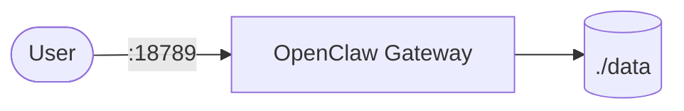

# OpenClaw

OpenClaw is a self-hosted AI gateway/control UI stack.  
This setup runs the OpenClaw gateway with persisted local state.

## How it works



1. The OpenClaw container starts the gateway process.
2. It serves API/control endpoints on mapped ports.
3. State/config files are persisted in the mounted `./data` directory.
4. The startup command clears stale lock/pid files before launch.

## Stack details in this repo

- Image: `ghcr.io/openclaw/openclaw:main-slim-amd64`
- Container name: `openclaw`
- Ports:
  - `18789`
  - `18791`
- Persistent data:
  - `./data:/home/node/.openclaw`
- Key environment:
  - `OPENCLAW_GATEWAY_CONTROLUI_ALLOWEDORIGINS`
  - `OPENCLAW_CONTROLUI_BIND=0.0.0.0`

## Environment variables

Environment variables are currently defined directly in `docker-compose.yml`.

## How to run

From the repository root:

```bash
cd openclaw
docker compose up -d
```

Useful commands:

```bash
docker compose ps
docker compose logs -f
docker compose restart
docker compose down
```

## Notes

- Keep the `./data` folder backed up if you want to preserve gateway state.
- Update allowed origins if you access the UI from non-localhost domains.
