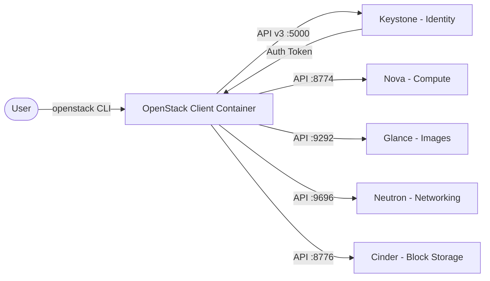
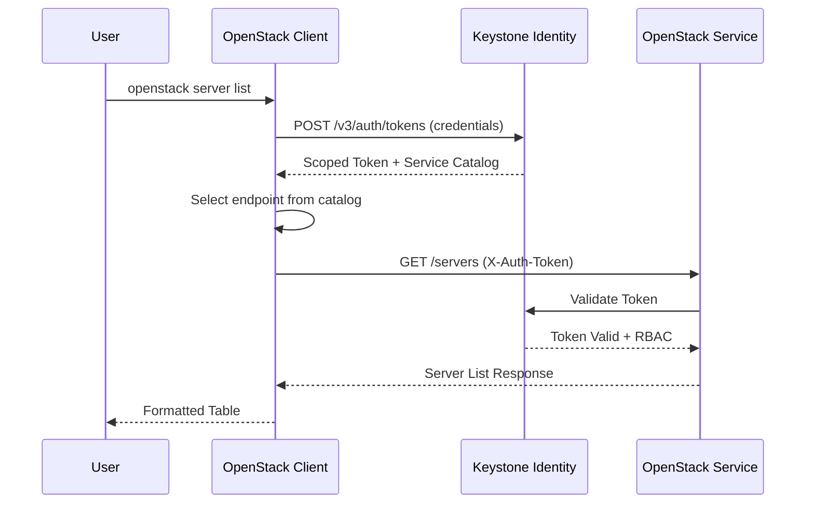

# OpenStack

OpenStack is an open-source cloud computing platform for Infrastructure-as-a-Service (IaaS) that manages compute, storage, and networking resources across a data centre.  
This stack provides the OpenStack CLI client for interacting with OpenStack clouds via the unified `openstack` command-line tool.

## How it works



Authentication and API request flow:



1. The user runs an `openstack` command (e.g. `openstack server list`) inside the container via `docker compose exec`.
2. The client reads the **clouds.yaml** configuration to locate the Keystone authentication endpoint and credentials.
3. A **scoped token** is requested from Keystone (v3 identity API) — the response includes the token and the **service catalog** listing all available OpenStack service endpoints.
4. The client selects the appropriate endpoint (Nova for compute, Glance for images, Neutron for networking, etc.) and sends the API request with the token in the `X-Auth-Token` header.
5. The target service validates the token with Keystone, checks RBAC permissions, and returns the result.
6. The client formats the output and displays it to the user.

## Stack details in this repo

| Service | Image | Purpose |
|---------|-------|---------|
| `openstack-client` | `python:3.12-slim` | OpenStack CLI (`openstack` command) |

Persistent data:

- `./clouds.yaml` — cloud configuration file (auth URLs, credentials, regions)
- `./scripts/` — shell scripts with example `openstack` commands
- `./data/` — working data and downloaded resources

## Environment variables

Set via `.env`:

| Variable | Default | Description |
|----------|---------|-------------|
| `OS_CLOUD` | `openstack` | Cloud profile name in `clouds.yaml` |

## How to run

From the repository root:

```bash
cd openstack
docker compose up -d
```

Useful commands:

```bash
docker compose ps
docker compose logs -f
docker compose exec openstack-client openstack --help
docker compose exec openstack-client openstack command list
docker compose exec openstack-client openstack server list
docker compose down
```

## How to use

### Configure cloud credentials

Edit `clouds.yaml` with your OpenStack cloud details:

```yaml
clouds:
  mycloud:
    auth:
      auth_url: https://controller:5000/v3
      username: admin
      password: changeme
      project_name: admin
      user_domain_name: Default
      project_domain_name: Default
    region_name: RegionOne
    interface: public
    identity_api_version: 3
```

Alternatively, use `secure.yaml` for sensitive credentials (auto-loaded by OSC):

```yaml
clouds:
  mycloud:
    auth:
      password: changeme
```

### List available resources

```bash
docker compose exec openstack-client openstack image list
docker compose exec openstack-client openstack flavor list
docker compose exec openstack-client openstack network list
docker compose exec openstack-client openstack project list
docker compose exec openstack-client openstack user list
```

### Manage projects and users

```bash
docker compose exec openstack-client openstack project create --description "Dev" dev-project
docker compose exec openstack-client openstack user create --password changeme --project dev-project dev-user
docker compose exec openstack-client openstack role add --user dev-user --project dev-project member
```

### Create and manage instances

```bash
# List available images and flavors
openstack image list
openstack flavor list

# Create a key pair
openstack keypair create mykey > mykey.pem

# Launch an instance
openstack server create --flavor m1.tiny --image cirros --network public --key-name mykey my-instance

# Check instance status
openstack server list
openstack server show my-instance

# Access console logs
openstack console log show my-instance

# Delete an instance
openstack server delete my-instance
```

### Manage block storage

```bash
# Create a volume
openstack volume create --size 10 my-volume

# Attach to an instance
openstack server add volume my-instance my-volume

# List volumes
openstack volume list
```

### Use environment variables instead of clouds.yaml

```bash
docker compose exec -e OS_AUTH_URL=http://controller:5000/v3 \
  -e OS_USERNAME=admin \
  -e OS_PASSWORD=changeme \
  -e OS_PROJECT_NAME=admin \
  -e OS_USER_DOMAIN_NAME=Default \
  openstack-client openstack server list
```

## Example files

The repository includes example files to get started:

- `clouds.yaml` — sample cloud configuration (edit with your cloud details)
- `examples/clouds.yaml.example` — standalone cloud config template
- `examples/openrc.sh.example` — OpenStack RC file with credentials as environment variables
- `scripts/openstack-commands.sh` — collection of common `openstack` commands

## Notes

- The container installs `python-openstackclient` on first start via pip. The installation is cached across restarts.
- Always use `secure.yaml` for passwords and secrets; commit only `clouds.yaml` with non-sensitive config (or use the environment variable approach).
- The `openstack` client supports `--os-cloud` to switch between profiles defined in `clouds.yaml`.
- For production clouds, consider mounting a `clouds.yaml` with application credentials (scoped tokens) instead of user passwords.
- To add additional OpenStack clients (heat, magnum, etc.), modify the `pip install` line in the compose command or create a custom Dockerfile.
