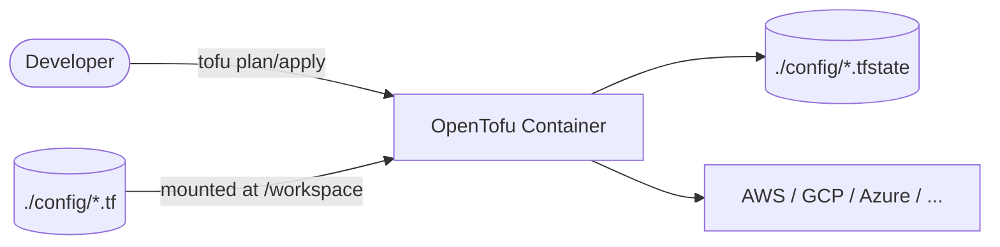
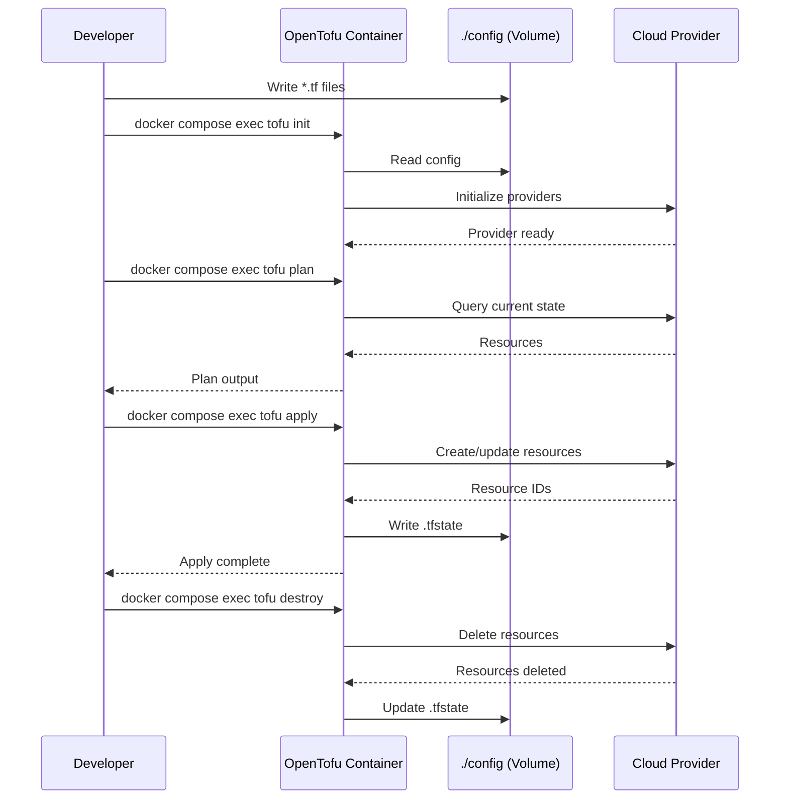

# OpenTofu

OpenTofu is an open-source infrastructure as code tool that lets you define, provision, and manage cloud and on-premises resources declaratively.  
This stack runs the official OpenTofu container image for executing Terraform/OpenTofu configurations.

## How it works





1. Place your `*.tf` configuration files in `config/`.
2. Run OpenTofu commands via `docker compose exec`.
3. OpenTofu executes inside the container using the mounted workspace.
4. State files are written back to `config/` for persistence.
5. Providers provision real infrastructure in your cloud targets.

## Stack details in this repo

- Image: `ghcr.io/opentofu/opentofu:minimal`
- Working directory inside container: `/workspace`
- Persistent data:
  - `./config/` — maps to `/workspace` (your `.tf` files and state)

## How to run

From the repository root:

```bash
cd opentofu
docker compose up -d
```

Useful commands:

```bash
docker compose exec opentofu tofu init
docker compose exec opentofu tofu plan
docker compose exec opentofu tofu apply
docker compose exec opentofu tofu destroy
docker compose logs -f
docker compose down
```

## Notes

- Place your `*.tf` configuration files in the `config/` directory.
- State files will be stored in `config/` as well.
- For multi-environment workflows, create subdirectories inside `config/` (e.g., `config/dev/`, `config/prod/`).
