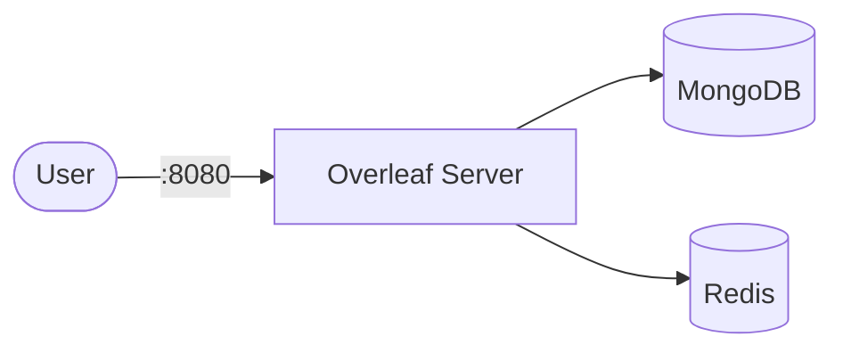

# Overleaf

Overleaf is an open-source online real-time collaborative LaTeX editor.  
It provides a browser-based editor with rich LaTeX support, collaboration features, and project management.

## How Overleaf works



1. Overleaf serves a web-based LaTeX editor with real-time collaboration.
2. MongoDB stores project data, user accounts, and document metadata.
3. Redis handles session caching and pub/sub for document updates.
4. LaTeX compilation runs inside the container (no sandboxing in CE).

## Stack details in this repo

- Image: `overleaf/overleaf:latest`
- Container name: `overleaf`
- Web UI: `http://<host-ip>:8080`
- Dependencies: MongoDB 8.0, Redis 6.2

## How to run

From the repository root:

```bash
cd overleaf
docker compose up -d
```

Open:

- Overleaf UI: `http://localhost:8080`

Register the first admin account on the welcome page.

Useful commands:

```bash
docker compose ps
docker compose logs -f
docker compose restart
docker compose down
```

## Use it effectively

- Overleaf supports real-time collaboration with multiple users editing the same document.
- Use the project management dashboard to organize LaTeX projects.
- Rich LaTeX editor with autocomplete, syntax highlighting, and PDF preview.
- Configure SMTP settings to enable email notifications and invitations.

## Notes

- MongoDB requires a replica set (`--replSet overleaf`) — this is configured automatically on first start.
- The Community Edition runs LaTeX compiles inside the main container; all users share the same environment.
- For production use with untrusted users, consider Overleaf Server Pro for sandboxed compiles.
- Change the host port via the `OVERLEAF_PORT` environment variable.
- See [Overleaf GitHub](https://github.com/overleaf/overleaf) for more details.
