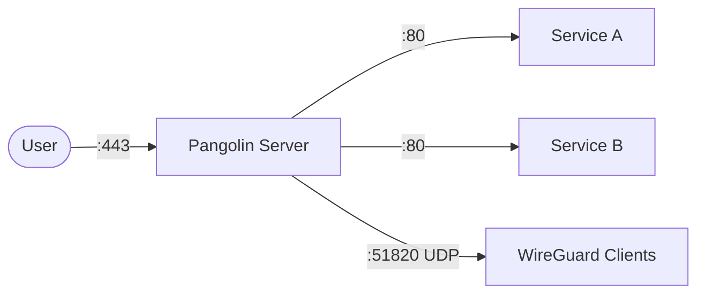

# Pangolin

Pangolin is a self-hosted tunnel management platform that provides secure remote access to your services. It combines a lightweight tunnel server with a reverse proxy and WireGuard VPN support.

## How Pangolin works



1. Pangolin listens on ports 80 (HTTP), 443 (HTTPS), and 51820/UDP (WireGuard).
2. Incoming requests are routed to backend services based on domain configuration.
3. WireGuard provides a secure VPN tunnel for remote access to your network.
4. A web dashboard allows you to manage tunnels, domains, and routing rules.

## Stack details in this repo

- Image: `ghcr.io/pangolin-org/pangolin:latest`
- Container name: `pangolin-server`
- Ports:
  - `80:80` — HTTP
  - `443:443` — HTTPS
  - `51820:51820/udp` — WireGuard
- Persistent data: `./data:/app/data`

## Environment variables

Configured directly in `docker-compose.yml`:

- `PANGOLIN_DOMAIN` — your domain name (e.g. `yourdomain.com`)
- `PANGOLIN_EMAIL` — admin email for the dashboard (e.g. `admin@yourdomain.com`)
- `PANGOLIN_SECRET` — a secure random secret string for authentication

Generate a strong secret:

```bash
openssl rand -hex 32
```

## How to run

From the repository root:

```bash
cd pangolin
docker compose up -d
```

Open:

- Dashboard: `http://localhost` (or your configured domain)

Useful commands:

```bash
docker compose ps
docker compose logs -f
docker compose restart
docker compose down
```

## Use it effectively

- Replace `PANGOLIN_DOMAIN` with your actual domain before starting.
- Point your DNS A record to the server's IP address.
- Use the dashboard to create tunnels and route traffic to internal services.
- Configure WireGuard clients to connect on port 51820 for VPN access.
- Set `PANGOLIN_SECRET` to a long, random value to secure the dashboard.

## Notes

- Ensure ports 80, 443, and 51820/UDP are open in your firewall.
- For production, use a valid domain with proper DNS configuration.
- The `./data` directory stores configuration and tunnel data — back it up regularly.
- Pangolin is designed for self-hosted use; review the documentation for advanced routing and security options.

## References

- Official site: <https://pangolin.io>
- GitHub repo: <https://github.com/pangolin-org/pangolin>
- Documentation: <https://docs.pangolin.io>
