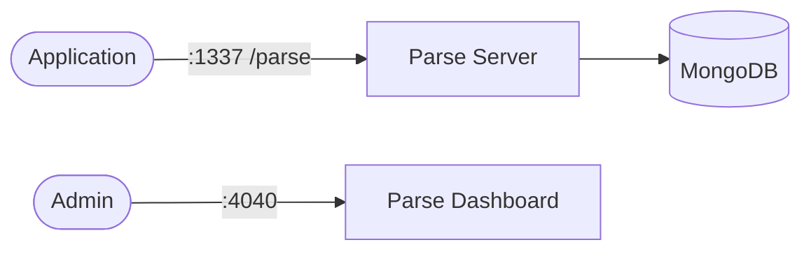

# Parse Server + MongoDB

This stack provides a self-hosted Parse backend with MongoDB storage and Parse Dashboard for management.

## How it works



1. `parse-db` runs MongoDB for Parse data persistence.
2. `parse-server` exposes the Parse API at `/parse`.
3. `parse-dashboard` provides a web UI to inspect classes, data, and app settings.

## Stack details in this repo

- Services:
  - `parse-db` (`mongo:7`)
  - `parse-server` (`parseplatform/parse-server:latest`)
  - `parse-dashboard` (`parseplatform/parse-dashboard:latest`)
- Ports:
  - Parse API: `http://localhost:1337/parse`
  - Parse Dashboard: `http://localhost:4040`
- Persistent data:
  - `parse_db_data:/data/db`

## Environment variables

Set via `.env` (copy from `.env.example`):

- `MONGO_ROOT_USERNAME`
- `MONGO_ROOT_PASSWORD`
- `PARSE_DB_NAME`
- `PARSE_APP_ID`
- `PARSE_MASTER_KEY`
- `PARSE_APP_NAME`
- `PARSE_ALLOW_CLIENT_CLASS_CREATION`
- `PARSE_SERVER_PORT`
- `PARSE_SERVER_URL`
- `PARSE_PUBLIC_SERVER_URL`
- `PARSE_MASTER_KEY_IPS`
- `PARSE_DASHBOARD_PORT`
- `PARSE_DASHBOARD_USER`
- `PARSE_DASHBOARD_PASS`
- `PARSE_DASHBOARD_ALLOW_INSECURE_HTTP`
- `PARSE_DASHBOARD_SERVER_URL`

## How to run

From the repository root:

```bash
cd parse-server+mongodb
cp .env.example .env
docker compose up -d
```

Open:

- Parse API: `http://localhost:1337/parse`
- Parse Dashboard: `http://localhost:4040`

Log in to Dashboard using:

- Username: `PARSE_DASHBOARD_USER`
- Password: `PARSE_DASHBOARD_PASS`

## Quick API test

Create object:

```bash
curl -X POST "http://localhost:1337/parse/classes/Todo" \
  -H "X-Parse-Application-Id: myAppId" \
  -H "X-Parse-Master-Key: myMasterKey" \
  -H "Content-Type: application/json" \
  -d "{\"title\":\"first item\",\"done\":false}"
```

List objects:

```bash
curl -X GET "http://localhost:1337/parse/classes/Todo" \
  -H "X-Parse-Application-Id: myAppId" \
  -H "X-Parse-Master-Key: myMasterKey"
```

Useful commands:

```bash
docker compose ps
docker compose logs -f
docker compose down
docker compose down -v
```

## Notes

- For production, set strong values for `PARSE_MASTER_KEY`, dashboard credentials, and use HTTPS/reverse proxy.
- If you change app ID or master key after data already exists, old clients must be updated with new values.
- If Dashboard shows "Parse Server failed to fetch", set `PARSE_DASHBOARD_SERVER_URL` to a URL reachable by your browser (for local host usage, keep `http://localhost:1337/parse`).
- If Dashboard shows "unauthorized", ensure `PARSE_MASTER_KEY` matches in both services and allow dashboard source IPs via `PARSE_MASTER_KEY_IPS` (local dev default: `0.0.0.0/0,::/0`).
