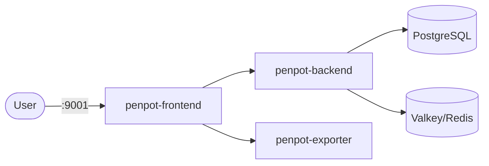

# Penpot

Penpot is the open-source design tool for design and code collaboration. It provides a web-based design and prototyping platform for creating UI/UX designs, wireframes, and interactive prototypes.

## How it works



1. User opens the Penpot web UI in the browser at port 9001.
2. The frontend container serves the web application and communicates with the backend.
3. The backend processes design data, storing it in PostgreSQL and using Valkey (Redis-compatible) for websocket notifications and caching.
4. The exporter handles design file export operations.
5. The MCP server provides AI/ML integration capabilities.

## Stack details in this repo

- Images:
  - `penpotapp/frontend:2.16`
  - `penpotapp/backend:2.16`
  - `penpotapp/exporter:2.16`
  - `penpotapp/mcp:2.16`
  - `postgres:15`
  - `valkey/valkey:8.1`
  - `sj26/mailcatcher:latest`
- Container names: `penpot-frontend`, `penpot-backend`, `penpot-exporter`, `penpot-mcp`, `penpot-postgres`, `penpot-valkey`, `penpot-mailcatch`
- Web UI: `http://<host-ip>:9001` (default)
- Mailcatcher UI: `http://<host-ip>:1080` (default)
- Port mappings:
  - `${PENPOT_PORT:-9001}:8080` (Penpot)
  - `${MAILCATCHER_PORT:-1080}:1080` (Mailcatcher)
- Volumes:
  - `penpot_postgres_v15` -> `/var/lib/postgresql/data` (database)
  - `penpot_assets` -> `/opt/data/assets` (user-uploaded assets)

## Environment variables

Copy `.env.example` to `.env`:

- `PENPOT_VERSION` (default: `2.16`) — Penpot image version tag
- `PENPOT_PUBLIC_URI` (default: `http://localhost:9001`) — Public-facing URI
- `PENPOT_SECRET_KEY` (default: `change-this-insecure-key`) — Master secret key
- `PENPOT_FLAGS` — Feature flags string
- `POSTGRES_DB` (default: `penpot`) — PostgreSQL database name
- `POSTGRES_USER` (default: `penpot`) — PostgreSQL user
- `POSTGRES_PASSWORD` (default: `penpot`) — PostgreSQL password
- `VALKEY_MAXMEMORY` (default: `128mb`) — Valkey max memory
- `PENPOT_PORT` (default: `9001`) — Penpot web UI port
- `MAILCATCHER_PORT` (default: `1080`) — Mailcatcher web UI port

## How to run

From the repository root:

```bash
cd penpot
cp .env.example .env
docker compose up -d
```

If you use Podman:

```bash
cd penpot
cp .env.example .env
podman compose up -d
```

Open:

- `http://localhost:9001` — Penpot UI
- `http://localhost:1080` — Mailcatcher (captured email viewer)

## Notes

- **Change `PENPOT_SECRET_KEY` in production** — generate a strong key with:
  ```bash
  python3 -c "import secrets; print(secrets.token_urlsafe(64))"
  ```
- Remove `disable-email-verification` and `disable-secure-session-cookies` flags when exposing Penpot to the internet.
- The mailcatcher service is for development only; configure a real SMTP provider for production.
- See the [official Penpot Docker setup](https://github.com/penpot/penpot/blob/develop/docker/images/docker-compose.yaml) and [configuration docs](https://help.penpot.app/technical-guide/configuration/) for advanced options.
