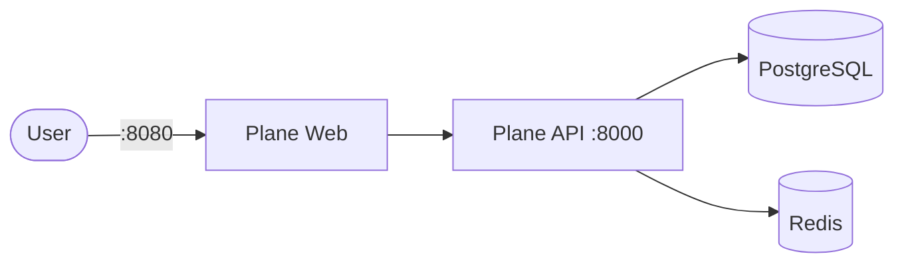

# Plane

Plane is an open-source project management tool (issues, projects, cycles).

## How it works



1. Plane Web serves the UI.
2. Plane API provides the backend API.
3. Redis is used for queues/background work.
4. PostgreSQL stores application data.

## Stack details in this repo

- Plane API image: `makeplane/plane-backend:latest`
- Plane Web image: `makeplane/plane-frontend:latest`
- PostgreSQL image: `postgres:15`
- Redis image: `redis:7`
- Plane Web UI: `http://<host-ip>:8080`
- Plane API: `http://<host-ip>:8000`
- Persistent data:
  - `plane-db:/var/lib/postgresql/data`
  - `plane-redis:/data`

## Environment variables

This compose file is self-contained and currently hard-codes environment variables in `docker-compose.yml` (no `.env` required).

## How to run

From the repository root:

```bash
cd plane
docker compose up -d
```

If you use Podman:

```bash
cd plane
podman compose up -d
```

Open:

- `http://localhost:8080`

## Notes

- The frontend is configured to call the API at `http://localhost:8000` by default.
- First startup can take a few minutes while migrations run and services initialize.
