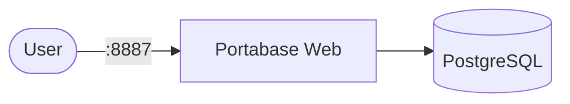

# Portabase

Portabase is a self-hosted application for building internal knowledge bases, intranet sites, and documentation portals. It runs as a containerized web app backed by PostgreSQL for persistent storage.

## How Portabase works



1. The Portabase web app starts and serves HTTP traffic on port `80` inside the container.
2. A PostgreSQL database container stores application data, user accounts, and configuration.
3. The app container depends on the database container and checks database availability before starting.
4. Persistent data is stored in Docker volumes so your content survives container restarts.

## Stack details in this repo

- App image: `portabase/portabase:latest`
- App container name: `portabase-app-prod`
- App web UI: `http://<host-ip>:8887`
- Database image: `postgres:16-alpine`
- Database port mapping: `5433:5432`
- Persistent data volumes:
  - `portabase-data:/data`
  - `postgres-data:/var/lib/postgresql/data`
- Environment file:
  - `.env`

## Environment variables

This compose setup uses a `.env` file for custom variables. By default, the database service includes:

- `POSTGRES_DB=devdb`
- `POSTGRES_USER=devuser`
- `POSTGRES_PASSWORD=changeme`

Update these values in `.env` or the compose config before deploying to a production environment.

## How to run

From the repository root:

```bash
cd portabase
docker compose up -d
```

Open:

- `http://localhost:8887`

Useful commands:

```bash
docker compose ps          # check container status
docker compose logs -f     # stream logs
docker compose restart     # restart service
docker compose down        # stop and remove containers
```

## Use Portabase effectively

- Use the web UI to create pages, collections, and internal documentation.
- Keep application data in `portabase-data` and database state in `postgres-data`.
- Use the `.env` file to manage credentials and environment settings.
- Ensure the database is healthy before relying on the web app startup.

## Notes

- The app listens on `8887` externally and forwards to port `80` inside the container.
- PostgreSQL is exposed on `5433` only for local development.
- Do not commit sensitive values from `.env` to source control.
- The app container includes a healthcheck that verifies `/api/health` before marking the service healthy.
