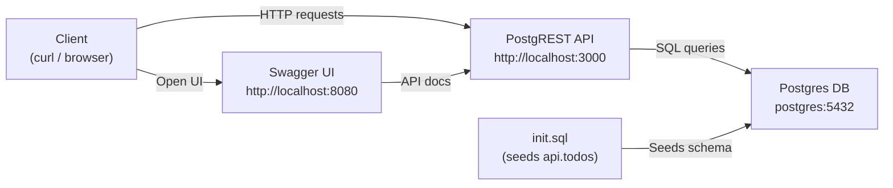

# PostgREST

PostgREST exposes a PostgreSQL schema as a RESTful API, enabling direct HTTP access to your database without writing backend code.
Clients send HTTP requests to PostgREST, which translates them into SQL queries and returns the results as JSON.

## How PostgREST works

1. Clients send HTTP requests (GET, POST, PATCH, DELETE) to the PostgREST API.
2. PostgREST translates requests into SQL and executes them against PostgreSQL.
3. Results are returned as JSON to the client.
4. Swagger UI provides interactive API documentation and testing.



## Stack details in this repo

- Image: `postgres:16-alpine`, container: `postgres_db`
- Image: `postgrest/postgrest:v12.2.3`, container: `postgrest_api`
- Image: `swaggerapi/swagger-ui:latest`, container: `swagger_ui`
- Postgres port: `5432`
- PostgREST API: `http://<host-ip>:3000`
- Swagger UI: `http://<host-ip>:8080`

## Environment variables

Set via `docker-compose.yml`:

- `POSTGRES_DB`, `POSTGRES_USER`, `POSTGRES_PASSWORD` — database credentials
- `PGRST_DB_URI` — PostgREST connection string to Postgres
- `PGRST_DB_SCHEMA` — schema to expose (default: `api`)
- `PGRST_DB_ANON_ROLE` — role used for anonymous requests

## How to run

From the repository root:

```bash
cd postgrest
docker compose up -d
```

Open:

- Swagger UI: `http://localhost:8080`
- PostgREST API: `http://localhost:3000`

Useful commands:

```bash
docker compose ps
docker compose logs -f postgrest_api
docker compose restart postgrest_api
docker compose down
```

## Use it effectively

Test with curl (base URL: `http://localhost:3000`):

- **Create** (POST):

  ```bash
  curl -s -X POST "http://localhost:3000/todos" \
    -H "Content-Type: application/json" \
    -H "Prefer: return=representation" \
    -d '{"task":"Buy milk","done":false}' | jq
  ```

- **Read all** (GET):

  ```bash
  curl -s "http://localhost:3000/todos" | jq
  ```

- **Read single** (GET):

  ```bash
  curl -s "http://localhost:3000/todos?id=eq.1" | jq
  ```

- **Update** (PATCH):

  ```bash
  curl -s -X PATCH "http://localhost:3000/todos?id=eq.1" \
    -H "Content-Type: application/json" \
    -H "Prefer: return=representation" \
    -d '{"done":true}' | jq
  ```

- **Delete** (DELETE):
  ```bash
  curl -s -X DELETE "http://localhost:3000/todos?id=eq.1"
  ```

## Notes

- `init.sql` seeds the `api.todos` table and grants `anon` read/write access.
- Change default DB credentials before exposing services externally.
- PostgREST docs: https://postgrest.org

## References

- PostgREST docs: https://postgrest.org
