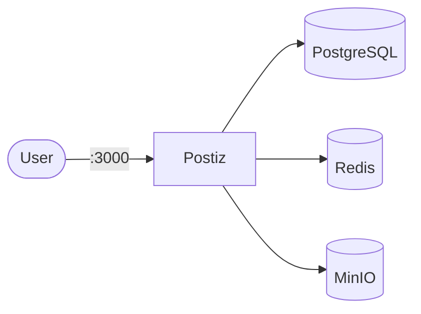

# Postiz

Postiz is a self-hosted social media scheduling and management tool.

## How it works



1. Postiz provides a web UI for scheduling posts across multiple platforms.
2. PostgreSQL stores posts, schedules, and user data.
3. Redis handles caching and background job processing.
4. MinIO stores media uploads.

## Stack details in this repo

- Postiz image: `ghcr.io/jamescarlos/postiz:latest`
- Dependencies: `postgres:16`, `redis:7`, `minio/minio:latest`
- UI endpoint: `http://<host-ip>:3000`
- Persistent data: named volumes (`postiz_data`, `minio_data`)

## Environment variables

Copy `.env.example` to `.env`:

- `POSTIZ_PORT`
- `POSTIZ_POSTGRES_USER`
- `POSTIZ_POSTGRES_PASSWORD`
- `POSTIZ_POSTGRES_DB`
- `POSTIZ_REDIS_HOST`
- `MINIO_ROOT_USER`
- `MINIO_ROOT_PASSWORD`

## How to run

```bash
cd postiz
cp .env.example .env
docker compose up -d
```

Podman:

```bash
cd postiz
cp .env.example .env
podman compose up -d
```

## Notes

- First startup initializes the database schema.
- Access the dashboard at `http://localhost:<POSTIZ_PORT>`
- Configure your social media API credentials for each platform.
