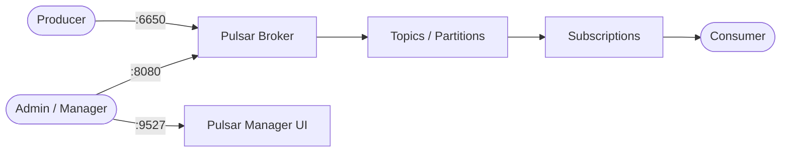

# Apache Pulsar

Apache Pulsar is a distributed messaging and streaming platform.  
It combines pub/sub messaging, queuing, and stream processing with multi-tenancy and geo-replication built in.

## How Apache Pulsar works



1. Producers publish messages to topics via the broker (binary protocol on port 6650).
2. Topics can be partitioned for parallel consumption and higher throughput.
3. Subscriptions (exclusive, shared, failover, key-shared) control how consumers receive messages.
4. The HTTP admin API (port 8080) manages tenants, namespaces, topics, and subscriptions.
5. Pulsar Manager provides a web UI for cluster administration.

## Stack details in this repo

- Pulsar image: `apachepulsar/pulsar:3.3.0`
- Manager image: `apachepulsar/pulsar-manager:latest`
- Container names: `pulsar`, `pulsar-manager`
- Broker port: `6650`
- Admin HTTP API: `http://<host-ip>:8080`
- Manager UI: `http://<host-ip>:9527`

## Environment variables

Set via `.env` (copy from `.env.example`):

- `PULSAR_BROKER_PORT` (default: `6650`)
- `PULSAR_HTTP_PORT` (default: `8080`)
- `PULSAR_MANAGER_PORT` (default: `9527`)

## How to run

From the repository root:

```bash
cd pulsar
cp .env.example .env
docker compose up -d
```

Open:

- Admin API: `http://localhost:8080`
- Pulsar Manager: `http://localhost:9527`

Useful commands:

```bash
# Check cluster health
docker compose exec pulsar bin/pulsar-admin brokers healthcheck

# List topics
docker compose exec pulsar bin/pulsar-admin topics list public/default

# Produce a test message
docker compose exec pulsar bin/pulsar-client produce my-topic --messages "hello pulsar"

# Consume messages
docker compose exec pulsar bin/pulsar-client consume my-topic -s test-sub -n 0

docker compose ps
docker compose logs -f pulsar
docker compose down
```

## Use it effectively

- Use namespaces and tenants to isolate workloads in multi-team environments.
- Leverage partitioned topics for high-throughput parallel processing.
- Use shared subscriptions for competing-consumer patterns (work queues).
- Enable message retention policies to replay historical messages.
- Use Pulsar Functions for lightweight stream processing without external frameworks.

## Notes

- The standalone mode runs all components (broker, BookKeeper, ZooKeeper) in a single process — suitable for development and testing.
- For production, deploy broker, BookKeeper, and ZooKeeper as separate services.
- Data persists across restarts via the `pulsar_data` volume.
- See [Apache Pulsar docs](https://pulsar.apache.org/docs/) for full configuration reference.
