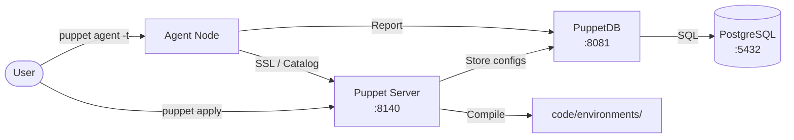
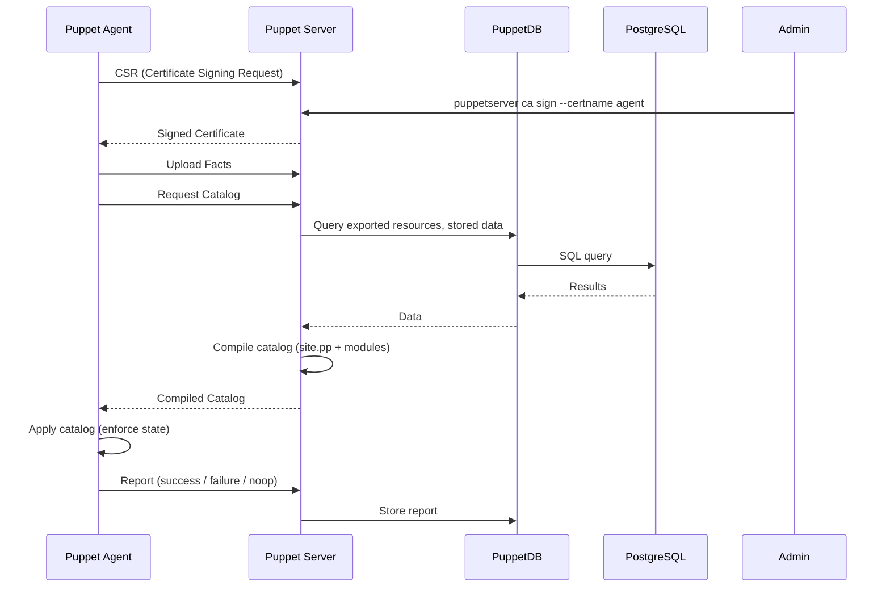

# Puppet

Puppet is a configuration management and compliance automation platform that enforces desired state across infrastructure using declarative code (Puppet DSL).  
This stack runs Puppet Server with PuppetDB and PostgreSQL for a full master-based deployment.

## How it works



Agent check-in flow:



1. Puppet Agents (nodes) initiate a connection to Puppet Server requesting a signed certificate (CSR).
2. An administrator signs the certificate on the server — certificates can also be autosigned for trusted subnets.
3. The agent submits system **facts** (OS, IP, memory, etc.) and requests its **catalog** — the compiled set of resources to manage.
4. Puppet Server queries PuppetDB for exported resources and stored data, then compiles the catalog from module code and site manifests.
5. The compiled catalog is returned to the agent, which **applies** it — creating files, packages, services, users, and more to match the desired state.
6. The agent sends a **report** back to the server detailing every resource change, failure, or no-op; the report is persisted in PuppetDB.

## Stack details in this repo

| Service | Image | Port | Purpose |
|---------|-------|------|---------|
| `puppetserver` | `puppet/puppetserver:latest` | `8140` | Certificate authority, catalog compiler |
| `puppetdb` | `puppet/puppetdb:latest` | `8081` | Facts, reports, exported resources storage |
| `puppetdb-postgres` | `postgres:15` | `5432` | Database backend for PuppetDB |

Persistent data:

- `./data/postgres/` — PostgreSQL data files
- `./data/puppetdb/ssl/` — PuppetDB SSL certificates
- `./data/puppetserver/code/` — Puppet code (environments, modules, manifests)  
- `./data/puppetserver/ssl/` — Puppet Server CA and SSL certificates
- `./data/puppetserver/logs/` — Server access and error logs

## Environment variables

Set via `.env`:

| Variable | Default | Description |
|----------|---------|-------------|
| `PUPPETDB_USER` | `puppetdb` | PostgreSQL username for PuppetDB |
| `PUPPETDB_PASSWORD` | `puppetdb` | PostgreSQL password for PuppetDB |
| `PUPPETSERVER_HOSTNAME` | `puppetserver` | Hostname advertised by Puppet Server |
| `PUPPETSERVER_JAVA_ARGS` | `-Xms512m -Xmx512m` | JVM heap settings for Puppet Server |

## How to run

From the repository root:

```bash
cd puppet
docker compose up -d
```

Useful commands:

```bash
docker compose ps
docker compose logs -f puppetserver
docker compose logs -f puppetdb
docker compose exec puppetserver puppetserver ca list
docker compose exec puppetserver puppetserver ca sign --certname <agent>
docker compose exec puppetserver puppetserver --help
docker compose down
docker compose down -v
```

## How to use

### Check server status

```bash
docker compose exec puppetserver puppetserver status
```

### Sign agent certificates

```bash
# List pending CSRs
docker compose exec puppetserver puppetserver ca list

# Sign a specific agent
docker compose exec puppetserver puppetserver ca sign --certname agent01
```

### Manage modules

```bash
docker compose exec puppetserver puppet module install puppetlabs-nginx
docker compose exec puppetserver puppet module list
```

### Apply a manifest locally

The repository includes an example manifest at `data/puppetserver/code/environments/production/manifests/site.pp` (and a copy in `examples/site.pp.example`):

```puppet
node default {
  package { 'curl':
    ensure => installed,
  }
  file { '/etc/motd':
    content => "Managed by Puppet\n",
  }
}
```

Then trigger an agent run from a node:

```bash
puppet agent -t --server puppetserver
```

## Example files

The repository includes example files to get started:

- `data/puppetserver/code/environments/production/manifests/site.pp` — site manifest with `default`, `webserver`, and `dbserver` node definitions
- `examples/site.pp.example` — standalone copy of the same manifest

### Query PuppetDB API

```bash
curl -s --cacert ./data/puppetserver/ssl/certs/ca.pem \
  --cert ./data/puppetserver/ssl/certs/puppetserver.pem \
  --key ./data/puppetserver/ssl/private_keys/puppetserver.pem \
  "https://localhost:8081/pdb/query/v4/nodes"
```

## Notes

- First startup takes 1–3 minutes while Puppet Server generates its CA and PuppetDB migrates the database schema. Watch `docker compose logs -f` for readiness.
- The Puppet Server container must use hostname `puppetserver` (or the value of `PUPPETSERVER_HOSTNAME`) for certificate SANs to match.
- For production, use a `.env` file with strong passwords and larger JVM heap (e.g. `-Xms2g -Xmx2g`).
- Agent nodes must be able to resolve `puppetserver` to the Docker host IP and reach port `8140`.
- Puppet code (modules, manifests) lives under `data/puppetserver/code/environments/production/`.
