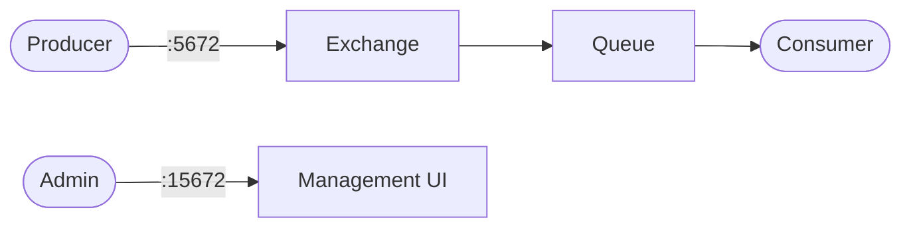

# RabbitMQ

RabbitMQ is a message broker for asynchronous communication between services.  
Producers publish messages to queues/exchanges, and consumers receive/process them.

## How RabbitMQ works



1. Producers publish messages to RabbitMQ.
2. RabbitMQ routes messages to queues based on exchange/binding rules.
3. Consumers subscribe to queues and process messages.
4. The management UI lets you inspect queues, exchanges, connections, and rates.

## Stack details in this repo

- Image: `rabbitmq:3-management`
- Container name: `rabbitmq`
- Hostname: `rabbitmq`
- AMQP port: `5672`
- Management UI: `http://<host-ip>:15672`

## Environment variables

Set via `.env` (copy from `.env.example`):

- `RABBITMQ_DEFAULT_USER` (default example: `admin`)
- `RABBITMQ_DEFAULT_PASS` (default example: `admin`)

## How to run

From the repository root:

```bash
cd rabbitmq
cp .env.example .env
docker compose up -d
```

Open:

- RabbitMQ UI: `http://localhost:15672`

Login using values from `.env`.

Useful commands:

```bash
docker compose ps
docker compose logs -f
docker compose restart
docker compose down
```

## Use it effectively

- Create queues/exchanges from the management UI for quick testing.
- Use the `example` folder scripts as a basic producer/consumer demo.
- Monitor unacked and ready message counts to detect backlogs.

## Notes

- Change default credentials before exposing RabbitMQ externally.
- Port `5672` should be reachable by app containers/services that publish or consume.
