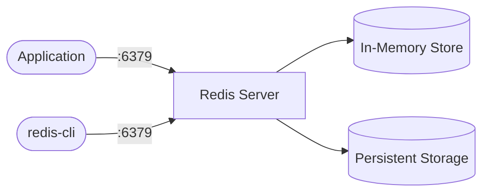

# Redis

Redis is an in-memory data store used as a cache, message broker, and key-value database.  
It supports strings, hashes, lists, sets, sorted sets, streams, and more.

## How Redis works



1. Applications connect to Redis over TCP (default port 6379).
2. Data is stored in memory for fast reads and writes.
3. Persistence options (RDB snapshots, AOF logs) write data to disk for durability.
4. The `redis-cli` tool provides interactive access for debugging and administration.

## Stack details in this repo

- Image: `redis:7-alpine`
- Container name: `redis`
- Port: `6379`
- Persistence: Docker volume `redis_data` mounted at `/data`

## Environment variables

Set via `.env` (copy from `.env.example`):

- `REDIS_PORT` (default: `6379`)
- `REDIS_PASSWORD` (default: `changeme`)

## How to run

From the repository root:

```bash
cd redis
cp .env.example .env
docker compose up -d
```

Connect with redis-cli:

```bash
docker compose exec redis redis-cli -a changeme
```

Useful commands:

```bash
docker compose ps
docker compose logs -f
docker compose restart
docker compose down
```

## Use it effectively

- Use as a session store or cache layer for your web applications.
- Leverage pub/sub for lightweight real-time messaging between services.
- Use Redis Streams for event sourcing or task queues.
- Monitor memory usage with `INFO memory` via redis-cli.

## Notes

- Change the default password before exposing Redis externally.
- The Alpine image keeps the footprint small (~30MB).
- Data persists across restarts via the `redis_data` volume.
- For production, consider enabling AOF persistence by adding `--appendonly yes` to the command.
