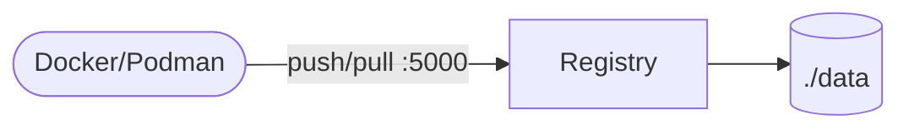

# Docker Registry

Distribution registry provides a private OCI/Docker image registry.

## How it works



1. Registry serves image push/pull API on port `5000`.
2. Images are stored in local filesystem storage.
3. Docker/Podman clients can tag and push to this endpoint.

## Stack details in this repo

- Image: `registry:2`
- Endpoint: `http://<host-ip>:5000`
- Persistent storage: `./data:/var/lib/registry`

## How to run

```bash
cd registry
cp .env.example .env
docker compose up -d
```

## Notes

- This setup is HTTP-only by default.
- Configure TLS/auth before exposing outside trusted networks.
