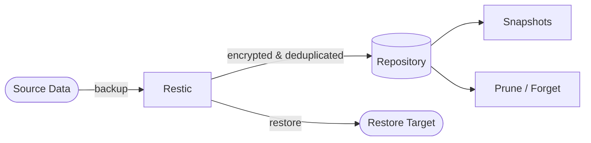

# Restic

Restic is a fast, secure, and efficient backup program.  
It supports encryption, deduplication, and multiple storage backends (local, S3, SFTP, REST, etc.).

## How Restic works



1. Restic reads source files and creates encrypted, deduplicated snapshots.
2. Snapshots are stored in a repository (local path, S3, SFTP, etc.).
3. Restores pull data from any snapshot back to a target directory.
4. Old snapshots can be pruned with retention policies to reclaim space.

## Stack details in this repo

- Image: `restic/restic:latest`
- Container name: `restic`
- Source mount: `./data` (read-only)
- Repository: Docker volume `restic_repo` at `/repo`

## Environment variables

Set via `.env` (copy from `.env.example`):

- `RESTIC_REPOSITORY` (default: `/repo`) — path or URL to the backup repository
- `RESTIC_PASSWORD` (default: `changeme`) — encryption password for the repository

## How to run

From the repository root:

```bash
cd restic
cp .env.example .env
```

Initialize the repository (first time only):

```bash
docker compose run --rm restic init
```

Create a backup:

```bash
docker compose run --rm restic backup /data
```

List snapshots:

```bash
docker compose run --rm restic snapshots
```

Restore a snapshot:

```bash
docker compose run --rm -v ./restore:/restore restic restore latest --target /restore
```

Useful commands:

```bash
# Check repository integrity
docker compose run --rm restic check

# Remove old snapshots (keep last 7 daily, 4 weekly)
docker compose run --rm restic forget --keep-daily 7 --keep-weekly 4 --prune

# Show repository stats
docker compose run --rm restic stats
```

## Use it effectively

- Place files to back up in the `./data` directory (or change the volume mount).
- Schedule backups with cron or a container scheduler for automated runs.
- Use S3-compatible storage by changing `RESTIC_REPOSITORY` to `s3:https://s3.amazonaws.com/bucket-name`.
- Combine `forget` and `prune` to manage snapshot retention and disk usage.

## Notes

- Change the default password before using in production — losing it means losing access to all backups.
- The `./data` directory is mounted read-only to prevent accidental modification during backup.
- For remote backends (S3, SFTP), add the relevant credentials as environment variables (e.g., `AWS_ACCESS_KEY_ID`, `AWS_SECRET_ACCESS_KEY`).
- See [Restic docs](https://restic.readthedocs.io/) for full configuration reference.
