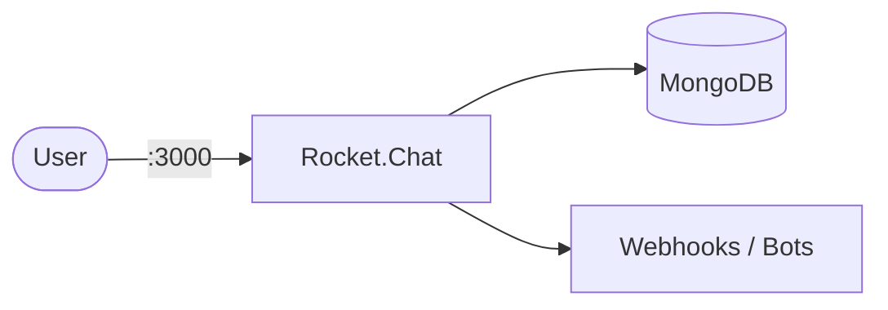

# Rocket.Chat

Rocket.Chat is a self-hosted team communication platform with channels, direct messages, video calls, and integrations.  
It's an open-source alternative to Slack with support for federation and omnichannel messaging.

## How Rocket.Chat works



1. Rocket.Chat serves the web UI and API on port 3000.
2. MongoDB stores users, messages, channels, and configuration.
3. A replica set is required for Rocket.Chat's oplog tailing (real-time updates).
4. Integrations support webhooks, bots, OAuth, and omnichannel livechat.

## Stack details in this repo

- Rocket.Chat image: `rocket.chat:latest`
- MongoDB image: `mongo:6.0`
- Container names: `rocketchat`, `rocketchat-mongo`, `rocketchat-mongo-init`
- Web UI: `http://<host-ip>:3000`
- Persistent data:
  - `mongo_data:/data/db`

## Environment variables

Set via `.env` (copy from `.env.example`):

- `ROCKETCHAT_PORT` (default: `3000`)
- `ROOT_URL` (default: `http://localhost:3000`)

## How to run

From the repository root:

```bash
cd rocket-chat
cp .env.example .env
docker compose up -d
```

Open:

- Rocket.Chat UI: `http://localhost:3000`

On first access, complete the setup wizard to create your admin account and organization.

Useful commands:

```bash
docker compose ps
docker compose logs -f rocketchat
docker compose restart
docker compose down
```

## Use it effectively

- Create channels for teams, projects, or topics.
- Set up incoming webhooks for CI/CD and monitoring notifications.
- Enable omnichannel for customer support livechat.
- Install apps from the Rocket.Chat Marketplace for extended functionality.

## Notes

- MongoDB must run as a replica set — the `mongo-init-replica` container handles initialization automatically.
- The init container runs once and exits; this is expected behavior.
- First startup may take a minute while MongoDB initializes the replica set.
- For production, set `ROOT_URL` to your public domain and configure TLS via a reverse proxy.
- See [Rocket.Chat docs](https://docs.rocket.chat/) for full configuration reference.
