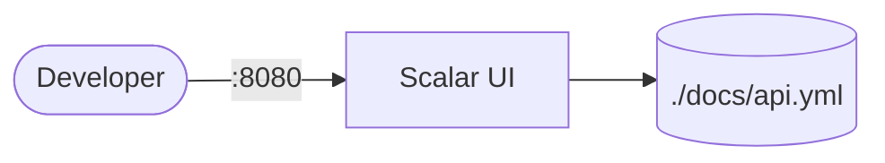
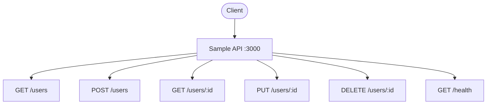

# Scalar

Scalar is a modern, beautiful API reference documentation tool.  
It renders OpenAPI/Swagger specs into interactive, developer-friendly API docs.

## How Scalar works



## Sample API Diagram



1. Scalar starts and serves an interactive API reference UI on port 8080.
2. It reads OpenAPI/Swagger spec files from the mounted `./docs` directory.
3. Developers browse endpoints, view schemas, and test API calls directly from the UI.
4. Changes to the spec file are reflected on reload — no rebuild needed.

## Stack details in this repo

- Image: `scalarapi/api-reference:latest`
- Container name: `scalar`
- Web UI: `http://<host-ip>:8080`
- Spec mount: `./docs:/docs`

## How to run

From the repository root:

```bash
cd scalar
docker compose up -d
```

Open:

- Scalar UI: `http://localhost:8080`

Place your OpenAPI spec in `./docs/` — Scalar automatically discovers all spec files in the directory tree.

```
docs/
├── api.yml

```

Useful commands:

```bash
docker compose ps
docker compose logs -f
docker compose restart
docker compose down
```

## Use it effectively

- Drop any OpenAPI 3.x or Swagger 2.0 spec into `./docs/` to render it.
- Use the built-in "Try It" feature to send live requests to your API.
- Customize the look by adding Scalar configuration options.
- Pair with your API development workflow — edit the spec, refresh the browser.

## Notes

- Scalar auto-discovers all `.yaml`, `.yml`, and `.json` OpenAPI files in the `/docs` mount (including subdirectories).
- Organize specs by audience: `internal/` for admin APIs, `external/` for partner-facing APIs.
- Scalar supports OpenAPI 3.0, 3.1, and Swagger 2.0 formats (YAML and JSON).
- No authentication or database required — it's a stateless documentation renderer.
- See [Scalar docs](https://github.com/scalar/scalar) for theming and configuration options.
