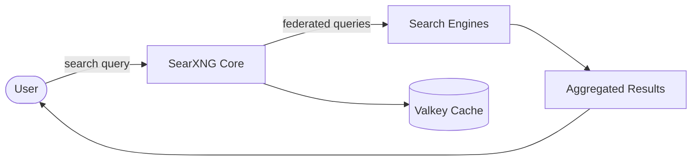

# SearXNG

SearXNG is a free, privacy-respecting metasearch engine that aggregates results
from many search services without tracking its users.

## How SearXNG works



1. Users submit queries through the SearXNG web UI or API.
2. SearXNG forwards the query to the configured search engines (Google, Bing, DuckDuckGo, Wikipedia, etc.).
3. Results are aggregated, deduplicated, and ranked.
4. Valkey caches responses to speed up repeated queries.

## Stack details in this repo

- Services: `core` (SearXNG) and `valkey` (cache backend)
- Images: `docker.io/searxng/searxng`, `docker.io/valkey/valkey:9-alpine`
- Container names: `searxng-core`, `searxng-valkey`
- Web endpoint: `http://<host-ip>:8080`
- Persistent data:
  - `core-data:/var/cache/searxng/` (favicon cache, etc.)
  - `valkey-data:/data/`
- Configuration: `./core-config/` mounted to `/etc/searxng/`

## Environment variables

Set via `.env` (copy from `.env.example`):

- `SEARXNG_VERSION` (default: `latest`) — image tag, e.g. `latest` or `2026.3.25-541c6c3cb`
- `SEARXNG_HOST` (default: `[::]`) — listen address
- `SEARXNG_PORT` (default: `8080`) — listen port

Additional `$SEARXNG_*` variables map to the `server:` and `general:` settings.
See the [settings docs](https://docs.searxng.org/admin/settings/index.html).

## How to run

From the repository root:

```bash
cd searxng
mkdir -p core-config
cp .env.example .env
docker compose up -d
```

Open `http://localhost:8080` in your browser.

Useful commands:

```bash
docker compose ps
docker compose logs -f core
docker compose restart
docker compose down
```

## Use it effectively

- Search from the browser UI at `http://localhost:8080`.
- Query the search API:

  ```bash
  curl "http://localhost:8080/search?q=searxng&format=json"
  ```

  Note: enable the JSON format in `core-config/settings.yml` (`server.formats`)
  to use `format=json` from other clients.
- Customize engines and behavior by editing files in `core-config/`
  (e.g. `settings.yml`, `engines.yml`, `favicons.toml`, `limiter.toml`).
- Update the services to their latest versions:

  ```bash
  docker compose down
  docker compose pull
  docker compose up -d
  ```

## Notes

- The `core-config/` directory holds the SearXNG configuration; create it before
  starting the stack and copy your preferred settings there.
- Data persists across restarts via the `core-data` and `valkey-data` volumes.
- If you expose the instance publicly, put it behind a reverse proxy (e.g.
  `traefik`, `caddy`, or `nginx`) and set the public URL in `settings.yml`.
- See [SearXNG docs](https://docs.searxng.org/admin/installation-docker.html)
  for the full container deployment guide.

## References

- Official site: <https://searxng.org>
- Documentation: <https://docs.searxng.org/>
- Docker Hub image: <https://hub.docker.com/r/searxng/searxng>
- GHCR mirror: <https://ghcr.io/searxng/searxng>
- GitHub repo: <https://github.com/searxng/searxng>
