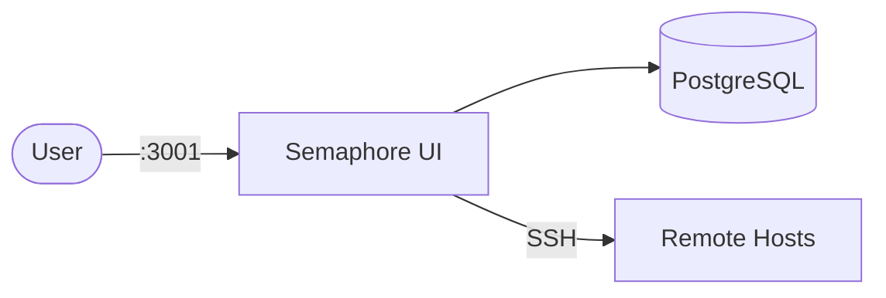

# Semaphore

This stack provides [Ansible Semaphore](https://github.com/semaphoreui/semaphore), a web UI and API for running Ansible playbooks and automation tasks.

## How it works



1. `semaphore-db` runs PostgreSQL to store projects, users, templates, and execution metadata.
2. `semaphore` runs the Semaphore web application and connects to PostgreSQL.
3. You log in to the web UI, register repositories/inventories, and run automation tasks.

## Stack details in this repo

- Services:
  - `semaphore-db` (`postgres:16`)
  - `semaphore` (`semaphoreui/semaphore:latest`)
- Ports:
  - Semaphore UI/API: `http://localhost:3001` (default)
- Persistent data:
  - `semaphore_db_data:/var/lib/postgresql/data`
  - `semaphore_data:/var/lib/semaphore`

## Environment variables

Set via `.env` (copy from `.env.example`):

- `SEMAPHORE_PORT`
- `SEMAPHORE_DB_NAME`
- `SEMAPHORE_DB_USER`
- `SEMAPHORE_DB_PASSWORD`
- `SEMAPHORE_ADMIN`
- `SEMAPHORE_ADMIN_PASSWORD`
- `SEMAPHORE_ADMIN_NAME`
- `SEMAPHORE_ADMIN_EMAIL`
- `SEMAPHORE_ACCESS_KEY_ENCRYPTION`

## How to run

From the repository root:

```bash
cd semaphore
cp .env.example .env
docker compose up -d
```

Open:

- UI: `http://localhost:3001`

Useful commands:

```bash
docker compose ps
docker compose logs -f semaphore
docker compose down
docker compose down -v
```

## Notes

- Change admin credentials and encryption key before exposing this stack outside local development.
- To run playbooks against remote hosts, make sure network/firewall and SSH credentials are configured in Semaphore.
