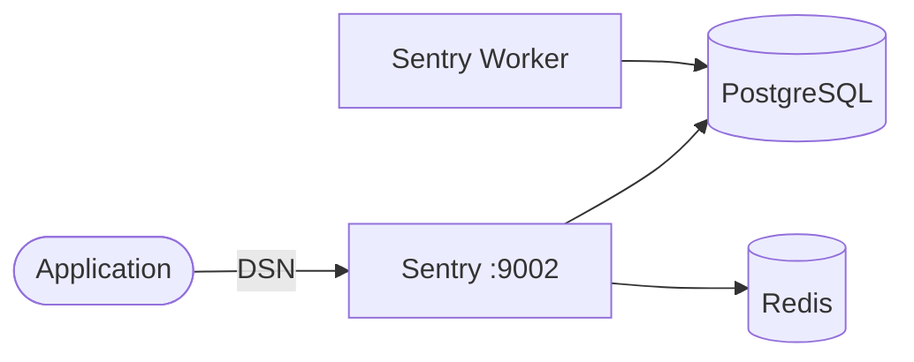

# Sentry

This stack provides self-hosted Sentry for application error tracking and performance monitoring.

## How it works



1. `sentry-db` runs PostgreSQL for Sentry metadata.
2. `sentry-redis` provides queue/cache backend for Sentry.
3. `sentry-init` runs one-time DB initialization/migrations.
4. `sentry` starts only after `sentry-init` completes successfully.

## Stack details in this repo

- Services:
  - `sentry-db` (`postgres:16`)
  - `sentry-redis` (`redis:7`)
  - `sentry-init` (`sentry:latest`, one-time migration job)
  - `sentry` (`sentry:latest`, web UI/API)
  - `sentry-worker` (`sentry:latest`, background jobs)
  - `sentry-cron` (`sentry:latest`, scheduled jobs)
- Ports:
  - Web UI: `http://localhost:9002`
- Persistent data:
  - `sentry_db_data:/var/lib/postgresql/data`
  - `sentry_data:/var/lib/sentry/files`

## Environment variables

Set via `.env` (copy from `.env.example`):

- `SENTRY_PORT`
- `SENTRY_SECRET_KEY`
- `SENTRY_DB_NAME`
- `SENTRY_DB_USER`
- `SENTRY_DB_PASSWORD`

## How to run

From the repository root:

```bash
cd sentry
cp .env.example .env
docker compose up -d
```

Open:

- UI: `http://localhost:9002`

## Create first user

Sentry does not create a default login user automatically.  
After `sentry-init` completes, create an admin user:

```bash
docker compose exec sentry sentry createuser
```

You will be prompted for:

- email
- password
- superuser (`y` for admin)

Non-interactive example:

```bash
docker compose exec sentry sentry createuser --email admin@example.com --password admin123 --superuser
```

## Reset password

If login fails or you forgot the password:

```bash
docker compose exec sentry sentry reset-password <your-email>
```

Example:

```bash
docker compose exec sentry sentry reset-password marcuwynu23@gmail.com
```

## Use Sentry in an Express.js app

After logging into Sentry:

1. Go to **Projects** -> **Create Project**.
2. Choose **Node.js** and create the project.
3. Copy the DSN from project settings.

Install SDK (use latest major unless you need legacy compatibility):

```bash
npm install @sentry/node
```

Minimal Express example:

```js
const express = require("express");
const Sentry = require("@sentry/node");

const app = express();

Sentry.init({
  dsn: "http://<public_key>@localhost:9002/<project_id>",
  tracesSampleRate: 1.0,
});

// Must be registered before routes
app.use(Sentry.Handlers.requestHandler());
app.use(Sentry.Handlers.tracingHandler());

app.get("/", (req, res) => {
  res.send("Hello from Express + Sentry");
});

// Error handler must be before any other error middleware
app.use(Sentry.Handlers.errorHandler());

app.use((err, req, res, next) => {
  res.status(500).json({
    message: "Internal Server Error",
    eventId: res.sentry, // Sentry event id (if available)
  });
});

app.listen(3000, () => {
  console.log("App listening on http://localhost:3000");
});
```

Trigger first event:

```bash
curl http://localhost:3000/debug-sentry
```

Then open Sentry UI (`http://localhost:9002`) and check the Issue Stream.

### Docker/Podman networking notes

- If your app runs on your host machine (outside containers), `localhost:9002` works for DSN host.
- If your app runs in another container, do not use `localhost`; use a reachable host/service address instead (for example `host.docker.internal` or `host.containers.internal` depending on runtime).

Useful commands:

```bash
docker compose ps
docker compose logs -f sentry-init
docker compose logs -f sentry
docker compose down
docker compose down -v
```

## Notes

- On first start, wait until `sentry-init` exits with code `0`, then open `http://localhost:9002`.
- If `createuser` returns a warning/traceback after showing `User created`, the user is usually still created successfully.
