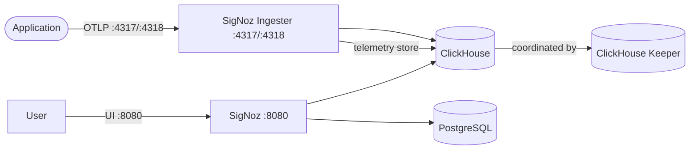

# SigNoz

This stack provides self-hosted SigNoz, an OpenTelemetry-native observability backend for distributed tracing, metrics, and logs.

## How it works



1. `signoz-clickhousekeeper` runs ClickHouse Keeper for cluster coordination.
2. `signoz-clickhouse` stores all telemetry data (traces, metrics, logs) in ClickHouse.
3. `signoz-clickhouse-user-scripts` is a one-time job that downloads the `histogramQuantile` executable function for ClickHouse.
4. `signoz-migrator` runs database schema migrations for ClickHouse on first startup.
5. `signoz-postgres` stores SigNoz application metadata (users, orgs, dashboards) in PostgreSQL.
6. `signoz` is the main application: UI, API, and query engine on port 8080.
7. `signoz-ingester` is the OpenTelemetry Collector that receives OTLP data on ports 4317 (gRPC) and 4318 (HTTP) and writes it to ClickHouse.
8. `app` is a sample Express.js application instrumented with OpenTelemetry SDK, sending telemetry to the ingester.

## Stack details in this repo

- Services:
  - `signoz-metastore-postgres-0` ([`postgres:16`](https://hub.docker.com/_/postgres)) — metadata storage
  - `signoz-telemetrykeeper-clickhousekeeper-0` ([`clickhouse/clickhouse-keeper:25.12.5`](https://hub.docker.com/r/clickhouse/clickhouse-keeper)) — cluster coordination
  - `signoz-telemetrystore-clickhouse-0-0` ([`clickhouse/clickhouse-server:25.12.5`](https://hub.docker.com/r/clickhouse/clickhouse-server)) — telemetry storage
  - `signoz-telemetrystore-migrator` (`signoz/signoz-otel-collector:latest`, one-time migration job) — schema migrations
  - `signoz` (`signoz/signoz:latest`) — UI, API, and query engine
  - `signoz-ingester` (`signoz/signoz-otel-collector:latest`) — OpenTelemetry Collector ingest
  - `app` — sample Express.js app with OpenTelemetry instrumentation (built from `./app/Dockerfile`)
- Ports:
  - SigNoz UI: `http://localhost:8080`
  - OTLP gRPC ingest: `localhost:4317`
  - OTLP HTTP ingest: `localhost:4318`
  - Sample app: `http://localhost:5000`
- Persistent data:
  - `signoz-metastore-postgres-0-data:/var/lib/postgresql/data`
  - `signoz-telemetrykeeper-0-data:/var/lib/clickhouse-keeper`
  - `signoz-telemetrystore-0-0-data:/var/lib/clickhouse`
  - `signoz-telemetrystore-user-scripts:/var/lib/clickhouse/user_scripts`
  - `signoz_signoz-data:/var/lib/signoz/`
- Mounted config:
  - `./ingester/ingester.yaml:/etc/otel-collector-config.yaml` — OpenTelemetry Collector pipeline config
  - `./ingester/opamp.yaml:/etc/opamp-config.yaml` — OpAMP client config
  - `./telemetrykeeper/clickhousekeeper/keeper-0.yaml:/etc/clickhouse-keeper/keeper.yaml` — ClickHouse Keeper config
  - `./telemetrystore/clickhouse/config-0-0.yaml:/etc/clickhouse-server/config-0-0.yaml` — ClickHouse server config
  - `./telemetrystore/clickhouse/functions.yaml:/etc/clickhouse-server/functions.yaml` — ClickHouse executable functions
  - `./app/Dockerfile` — sample application build context

## Environment variables

Copy `.env.example` to `.env` and adjust as needed:

- `SIGNOZ_PORT` — SigNoz UI port (default `8080`)
- `SIGNOZ_OTLP_GRPC_PORT` — OTLP gRPC ingest port (default `4317`)
- `SIGNOZ_OTLP_HTTP_PORT` — OTLP HTTP ingest port (default `4318`)
- `SIGNOZ_POSTGRES_DB` — PostgreSQL database name
- `SIGNOZ_POSTGRES_USER` — PostgreSQL user
- `SIGNOZ_POSTGRES_PASSWORD` — PostgreSQL password
- `SIGNOZ_SQLSTORE_PROVIDER` — metadata store provider (`postgres`)
- `SIGNOZ_SQLSTORE_POSTGRES_DSN` — PostgreSQL connection string for SigNoz
- `SIGNOZ_TELEMETRYSTORE_PROVIDER` — telemetry store provider (`clickhouse`)
- `SIGNOZ_TELEMETRYSTORE_CLICKHOUSE_DSN` — ClickHouse connection string
- `SIGNOZ_OTEL_RESOURCE_ATTRIBUTES` — resource attributes for the collector
- `SIGNOZ_LOW_CARDINAL_EXCEPTION_GROUPING` — enable low-cardinality exception grouping
- `SIGNOZ_OTEL_COLLECTOR_CLICKHOUSE_REPLICATION` — enable ClickHouse replication
- `APP_PORT` — sample application port (default `5000`)
- `NODE_ENV` — Node.js environment for the sample app
- `OTEL_EXPORTER_OTLP_ENDPOINT` — OTLP endpoint the sample app sends telemetry to (default `http://signoz-ingester:4317`)
- `OTEL_EXPORTER_OTLP_PROTOCOL` — OTLP protocol (default `grpc`)
- `OTEL_SERVICE_NAME` — service name for the sample app's telemetry
- `APP_VERSION` — service version for the sample app

## How to run

From the repository root:

```bash
cd signoz
cp .env.example .env
docker compose up -d
```

Open:

- SigNoz UI: `http://localhost:8080`
- Sample app: `http://localhost:5000`

> **Note:** First startup takes a few minutes. The `signoz-migrator` and `signoz-clickhouse-user-scripts` jobs run once to set up the database schema and download required binaries. Wait for the `signoz` service health check to pass before logging in. The sample `app` service starts once the ingester is ready.

Useful commands:

```bash
docker compose ps
docker compose logs -f signoz
docker compose logs -f signoz-ingester
docker compose logs -f app
docker compose logs -f signoz-migrator
docker compose restart
docker compose down
docker compose down -v
```

## Instrumentation

The stack includes a sample Express.js application (`app` service) already instrumented with the OpenTelemetry Node.js SDK. It sends traces, metrics, and logs to the SigNoz ingester.

### Sample app endpoints

- `GET /` — returns a greeting message with a traced span
- `GET /health` — health check endpoint
- `GET /api/items` — returns a list of items (instrumented span)
- `GET /api/error` — returns a 500 error (to see error tracking in SigNoz)

To send telemetry from your own application, configure the OTLP exporter to point at the ingest ports:

| Protocol | Endpoint |
|----------|----------|
| OTLP gRPC | `http://localhost:4317` |
| OTLP HTTP | `http://localhost:4318` |

Example (Node.js):

```bash
npm install @opentelemetry/api @opentelemetry/sdk-node @opentelemetry/auto-instrumentations-node
```

```js
const { NodeSDK } = require('@opentelemetry/sdk-node');
const { getNodeAutoInstrumentations } = require('@opentelemetry/auto-instrumentations-node');
const { OTLPTraceExporter } = require('@opentelemetry/exporter-trace-otlp-grpc');
const { OTLPMetricExporter } = require('@opentelemetry/exporter-metrics-otlp-grpc');

const sdk = new NodeSDK({
  traceExporter: new OTLPTraceExporter({ url: 'http://localhost:4317' }),
  metricExporter: new OTLPMetricExporter({ url: 'http://localhost:4317' }),
  instrumentations: [getNodeAutoInstrumentations()],
});

sdk.start();
```

## Notes

- The default SigNoz login credentials are `user@example.com` / `usermail123` unless `SIGNOZ_INITIAL_ADMIN_PASSWORD` is set.
- If the `signoz-migrator` or `signoz-clickhouse-user-scripts` jobs fail on first run, you can re-run them with `docker compose up signoz-migrator`.
- ClickHouse requires at least 4 GB of memory. Ensure Docker is allocated enough resources.
- The sample `app` service is built locally from `./app/Dockerfile`; it requires Docker build support.
