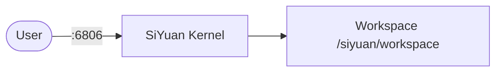

# SiYuan

SiYuan is a privacy-first, self-hosted personal knowledge management system.  
It supports block-level references, Markdown WYSIWYG editing, and a graph view for knowledge connections.

## How SiYuan works



1. SiYuan starts a kernel process serving the web UI on port 6806.
2. Users access the editor in a browser to create and manage notes.
3. All data is stored in the workspace folder as `.sy` JSON files.
4. A configurable access auth code protects the workspace.

## Stack details in this repo

- Image: `b3log/siyuan:latest`
- Container name: `siyuan`
- Web UI: `http://<host-ip>:6806`
- Data: `./workspace/` (configurable via `SIYUAN_WORKSPACE`)

## How to run

From the repository root:

```bash
cd siyuan
# Set an access auth code (required for security)
echo "SIYUAN_AUTH_CODE=your-strong-password" > .env
docker compose up -d
```

Open:

- SiYuan UI: `http://localhost:6806`

Useful commands:

```bash
docker compose ps
docker compose logs -f
docker compose restart
docker compose down
```

## Use it effectively

- Use block-level references (`((block-id))`) to create bidirectional links between content.
- The graph view shows how your notes are connected.
- Use SQL queries to embed dynamic content from your knowledge base.
- Set `PUID` and `PGID` to match your host user to avoid permission issues.

## Notes

- Set `SIYUAN_AUTH_CODE` in `.env` to password-protect your workspace.
- The workspace folder must be writable by UID 1000 (or the `PUID` you set).
- Change the host port via the `SIYUAN_PORT` environment variable.
- See [SiYuan GitHub](https://github.com/siyuan-note/siyuan) for more details.
