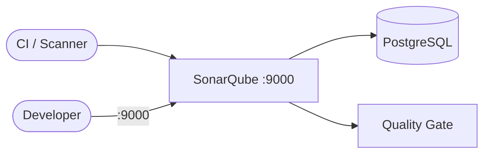

# SonarQube

SonarQube is a code quality and security analysis platform.  
It helps detect bugs, code smells, and vulnerabilities, and provides quality gates for CI/CD.

## How it works



1. SonarQube runs the web UI and analysis backend.
2. PostgreSQL stores SonarQube metadata (projects, issues, users, settings).
3. Your CI (or local scanner) sends analysis results to SonarQube.
4. SonarQube displays reports, measures, and quality gate status in the UI.

## Stack details in this repo

- SonarQube image: `sonarqube:lts-community`
- PostgreSQL image: `postgres:16`
- SonarQube UI: `http://<host-ip>:9000`
- Persistent data:
  - `sonarqube_db:/var/lib/postgresql/data`
  - `sonarqube_data:/opt/sonarqube/data`
  - `sonarqube_extensions:/opt/sonarqube/extensions`
  - `sonarqube_logs:/opt/sonarqube/logs`

## Environment variables

Copy `.env.example` to `.env`:

- `SONARQUBE_PORT` (default: `9000`)
- `SONARQUBE_DB_USER`
- `SONARQUBE_DB_PASSWORD`
- `SONARQUBE_DB_NAME`

## How to run

From the repository root:

```bash
cd sonarqube
cp .env.example .env
docker compose up -d
```

If you use Podman:

```bash
cd sonarqube
cp .env.example .env
podman compose up -d
```

Open:

- `http://localhost:9000`

## First login

Default SonarQube credentials (change after first login):

- Username: `admin`
- Password: `admin`

## Notes

- SonarQube requires some kernel settings (especially on Linux) for Elasticsearch internals:
  - `vm.max_map_count` is commonly required to be at least `262144`.
- First startup can take a few minutes while services initialize.

## References and Guide

- [SonarQube Github Setup Guide](https://gremoire.marcuwynu.space/article/articles/devops/sonarcube-github-setup-guide)
