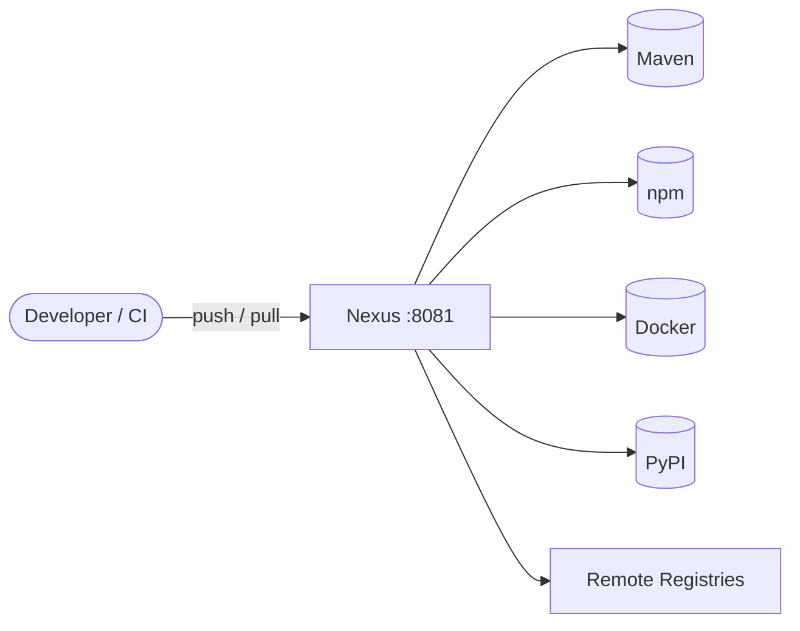

# Sonatype Nexus

Sonatype Nexus Repository is a repository manager for all internal and
third-party binaries, components, and packages (Maven, npm, Docker, PyPI,
Helm, NuGet, and more) — the single source of truth for artifacts across
the SDLC.

## How Nexus works



1. Build tools push and pull artifacts through a single endpoint on port 8081.
2. Hosted repositories store internal artifacts; proxy repositories cache remote ones.
3. All content is persisted under `/nexus-data`.

## Stack details in this repo

- Service: `nexus`
- Image: `docker.io/sonatype/nexus3:latest` (Alpine-based, Java 21)
- Container name: `nexus`
- Web UI / API: `http://<host-ip>:8081`
- Persistent data:
  - `nexus-data:/nexus-data` (configuration, logs, storage)

## Environment variables

Optional:

- `INSTALL4J_ADD_VM_PARAMS` — JVM arguments (e.g. `-Xms2703m -Xmx2703m -XX:MaxDirectMemorySize=2703m`)
- `NEXUS_CONTEXT` — web context path (default: `/`)

## How to run

From the repository root:

```bash
cd sonatype-nexus
docker compose up -d
```

Open `http://localhost:8081`. The default user is `admin`; the initial
password is generated on first start and stored in the `admin.password`
file inside the volume:

```bash
docker exec nexus cat /nexus-data/admin.password
```

Useful commands:

```bash
docker compose ps
docker compose logs -f
docker compose restart
docker compose down
```

## Use it effectively

- Nexus takes 2-3 minutes to become ready in a new container — tail the logs
  (`docker compose logs -f`) to see when it is up.
- Create hosted repositories for internal artifacts and proxy repositories for
  Maven Central, npmjs, Docker Hub, PyPI, etc.
- Use repository targets, retention, and cleanup policies to manage storage.
- To use a host bind mount instead of a named volume, create the directory
  first and make it writable by UID 200: `mkdir nexus-data && chown -R 200 nexus-data`.

## Notes

- The Nexus process runs as UID 200; `/nexus-data` must be writable by that user.
- Allow enough time (up to 120s) when stopping so the embedded databases shut down cleanly.
- See the [Nexus Repository documentation](https://help.sonatype.com/repomanager3) for full configuration.

## References

- Documentation: <https://help.sonatype.com/repomanager3>
- GitHub repo: <https://github.com/sonatype/docker-nexus3>
- Docker Hub image: <https://hub.docker.com/r/sonatype/nexus3>
