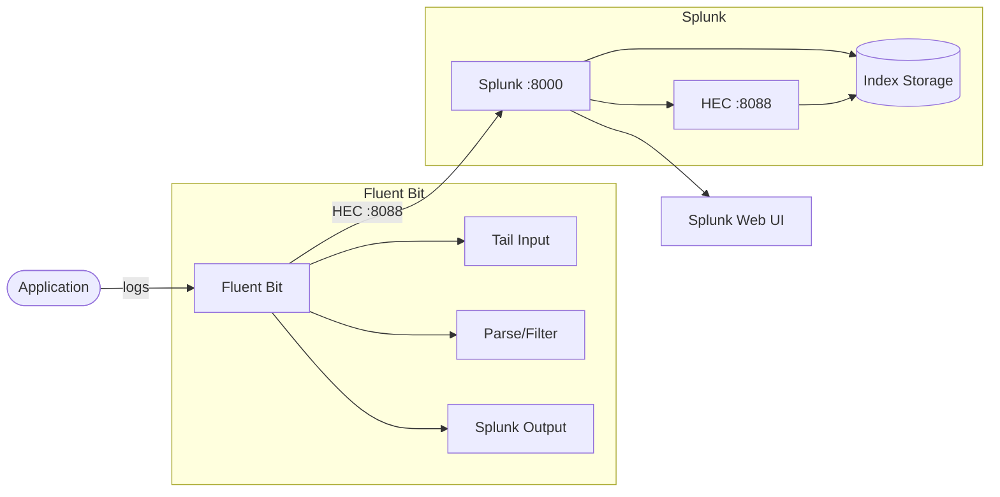
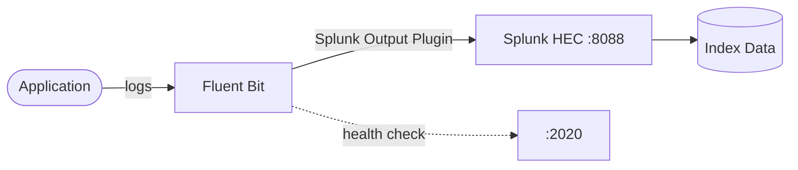

# Splunk

Splunk is a unified platform for monitoring, searching, analyzing, and visualizing machine-generated data at scale.  
This stack runs a single Splunk Enterprise instance for local/dev usage.

## What is Splunk?

Splunk ingests, indexes, and correlates machine data from virtually any source — logs, metrics, traces, security events, and more — providing a single source of truth for your organization's data.

## Use Cases

Splunk is widely used across multiple domains:

### Security (SIEM)
- **Threat detection & hunting** — Proactively uncover potential threats and anomalies.
- **Incident response** — Investigate and respond to security events in real time.
- **Compliance reporting** — Meet regulatory requirements (PCI, HIPAA, GDPR) with audit trails.
- **Risk-based alerting** — Prioritize security events by risk score.

### Observability & IT Operations
- **Infrastructure monitoring** — Track CPU, memory, disk, and network performance across systems.
- **Application performance monitoring (APM)** — Monitor application health, latency, and errors.
- **Log management** — Centralize, search, and analyze logs from any source.
- **Service level management** — Track SLAs and uptime metrics.

### DevOps & Engineering
- **Continuous deployment monitoring** — Track releases and deployment health.
- **Cloud monitoring** — Monitor cloud service providers (AWS, Azure, GCP).
- **Federated search** — Analyze data across platforms like S3, Snowflake, and Databricks.

### Business Analytics
- **Customer journey analysis** — Understand user interactions and behavior.
- **Help desk analytics** — Analyze support ticket patterns and resolution times.
- **Fraud detection** — Identify suspicious transaction patterns.

### Industry-Specific
- **Retail** — Monitor site performance and prevent revenue loss from downtime.
- **Healthcare** — Ensure compliance and track environmental/operational data.
- **Finance** — Detect fraud and secure financial transactions.
- **Education** — Protect hybrid campus infrastructure.

## How it works

### Standalone Splunk


1. Splunk starts and accepts the license agreement automatically.
2. The web UI is exposed on port `8083` (container port `8000`).
3. Data is indexed internally by Splunk for search and analysis.

### Splunk + Fluent Bit Integration



1. Applications write logs to files or stdout.
2. Fluent Bit collects, parses, and forwards logs via the **Splunk output plugin**.
3. Logs are sent to Splunk's **HTTP Event Collector (HEC)** on port `8088`.
4. Splunk indexes the data for search, analysis, and visualization.

## Stack details in this repo

- Image: `splunk/splunk:latest`
- Container name: `splunk`
- Ports:
  - `8083` (Splunk Web UI)
- Environment variables:
  - `SPLUNK_START_ARGS` — Splunk startup arguments
  - `SPLUNK_GENERAL_TERMS` — Accept Splunk General Terms
  - `SPLNK_PASSWORD` — Admin password for Splunk

## Environment variables

The following environment variables are configured in `docker-compose.yml`:

- `SPLUNK_START_ARGS` — Set to `--accept-license` to automatically accept the license on startup.
- `SPLUNK_GENERAL_TERMS` — Set to `--accept-sgt-current-at-splunk-com` to accept the Splunk General Terms.
- `SPLNK_PASSWORD` — Sets the admin password for the Splunk instance.

## How to run

From the repository root:

```bash
cd splunk
docker compose up -d
```

Open Splunk Web UI:

- Splunk UI: `http://localhost:8083`

> **Note:** On first startup, Splunk initializes its indexes and may take a few minutes before the web UI is fully ready. Wait until the container is healthy before logging in.

Useful commands:

```bash
docker compose ps
docker compose logs -f splunk
docker compose restart
docker compose down
docker compose down -v
```

## Integration with Fluent Bit

[Fluent Bit](https://fluentbit.io/) is a lightweight log processor and forwarder that can route logs to Splunk via the **HTTP Event Collector (HEC)** interface. This is a common pattern for centralized log pipelines:



### How it works

1. Fluent Bit collects logs from applications, containers, or files using `tail`, `syslog`, or other input plugins.
2. The **Splunk output plugin** forwards logs to Splunk's HEC endpoint.
3. Splunk indexes and makes the data searchable.

### Prerequisites

- Splunk HEC must be enabled in **Settings > Data Inputs > HTTP Event Collector**.
- Generate an HEC token in Splunk and use it for authentication.
- The Splunk container exposes HEC on port `8088` (in addition to the web UI on `8083`).

### Fluent Bit Configuration

Add the following output section to your Fluent Bit configuration:

```ini
[OUTPUT]
    Name            splunk
    Match           *
    Host            host.docker.internal
    Port            8088
    Splunk_Token    <YOUR_HEC_TOKEN>
    Tls             Off
    Tls.Verify      Off
    Index           main
    Message_Key     message
```

Or using `fluent-bit.yaml`:

```yaml
pipeline:
  inputs:
    - name: tail
      path: /var/log/app/*.log
      tag: app
  outputs:
    - name: splunk
      match: '*'
      host: host.docker.internal
      port: 8088
      splunk_token: <YOUR_HEC_TOKEN>
      tls: off
      tls_verify: off
      index: main
```

### Running both stacks together

From the repository root:

```bash
cd splunk
docker compose up -d

cd fluentbit
cp .env.example .env
docker compose up -d
```

> **Note:** When running both stacks, Fluent Bit needs to reach Splunk's HEC port (`8088`). Use `host.docker.internal` to reference the host from within a container, or use the Splunk container name if both stacks share the same Docker network. Ensure the HEC token is correctly configured in both Splunk and Fluent Bit.

### Useful Fluent Bit commands

```bash
docker compose ps
docker compose logs -f fluent-bit
curl http://localhost:2020/api/v1/health
```

### References

- [Fluent Bit Splunk Output Plugin](https://docs.fluentbit.io/manual/pipeline/outputs/splunk)
- [Splunk HTTP Event Collector Documentation](https://docs.splunk.com/Documentation/Splunk/latest/Data/UsetheHTTPEventCollector)
- [Fluent Bit Official Documentation](https://docs.fluentbit.io/)

## References

- **[Official Website](https://www.splunk.com)** — Splunk homepage, products, and resources.
- **[Documentation](https://docs.splunk.com/Documentation)** — Comprehensive Splunk documentation and guides.
- **[Splunk Lantern](https://lantern.splunk.com/)** — Customer success center with tips, use cases, and how-tos.
- **[Splunk Use Cases](https://www.splunk.com/en_us/solutions/all-use-cases.html)** — Explore all use cases across security, observability, and more.
- **[Splunk Community](https://www.splunk.com/en_us/community.html)** — Ask questions and share knowledge with the Splunk community.
- **[Splunkbase](https://splunkbase.splunk.com/)** — Browse 1,000+ apps and add-ons.
- **[Splunk Dev](https://dev.splunk.com/)** — Build your own Splunk apps and integrations.
- **[Splunk Training & Certification](https://www.splunk.com/en_us/training.html)** — Become a certified Splunk expert.
- **[Splunk Download](https://www.splunk.com/en_us/download.html)** — Free trials and downloads.
- **[Splunk Enterprise Pricing](https://www.splunk.com/en_us/products/pricing.html)** — Pricing information.

## Notes

- The default admin password is set via the `SPLNK_PASSWORD` environment variable. Change it to a strong password before deploying.
- This config is intended for local development and testing only. For production, use a more robust Splunk deployment with persistent storage and proper resource allocation.
- Splunk requires significant system resources (memory and CPU). Ensure Docker is allocated at least 4 GB of RAM.
- The `splunk/splunk:latest` image may change over time; pin a specific tag for reproducible deployments.
- For a full production setup, consider adding persistent volumes for data retention and configuring Splunk Enterprise Security (ES) or Splunk IT Service Intelligence (ITSI) add-ons.
