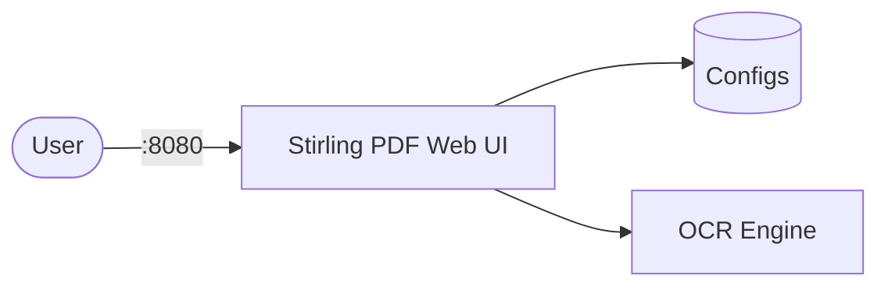

# Stirling PDF

Stirling PDF is a powerful, self-hosted PDF manipulation tool with 50+ operations.  
Merge, split, convert, compress, sign, redact, and OCR PDFs — all locally, no data leaves your server.

## How Stirling PDF works



1. Stirling PDF serves a web UI with 50+ PDF tools.
2. All file processing happens in-memory on the server.
3. OCR uses Tesseract for scanned document text extraction.
4. Optional pipelines allow chaining multiple operations.

## Stack details in this repo

- Image: `stirlingtools/stirling-pdf:latest`
- Container name: `stirling-pdf`
- Web UI: `http://<host-ip>:8080`
- Default login: `admin` / `stirling` (when login enabled)

## How to run

From the repository root:

```bash
cd stirling-pdf
docker compose up -d
```

Open:

- Stirling PDF UI: `http://localhost:8080`

Useful commands:

```bash
docker compose ps
docker compose logs -f
docker compose restart
docker compose down
```

## Use it effectively

- Upload PDFs for merging, splitting, compressing, converting, signing, and more.
- OCR scanned documents to make them searchable (100+ languages supported).
- Use pipelines to chain multiple PDF operations into a single automated workflow.
- The REST API enables integration with external scripts and automation.

## Notes

- Login is enabled by default with credentials `admin` / `stirling` — change the password on first login.
- Set `SECURITY_ENABLELOGIN=false` to disable authentication.
- Download OCR language packs to `/usr/share/tessdata` for additional languages.
- Change the host port via the `STIRLING_PDF_PORT` environment variable.
- See [Stirling PDF GitHub](https://github.com/Stirling-Tools/Stirling-PDF) for more details.
