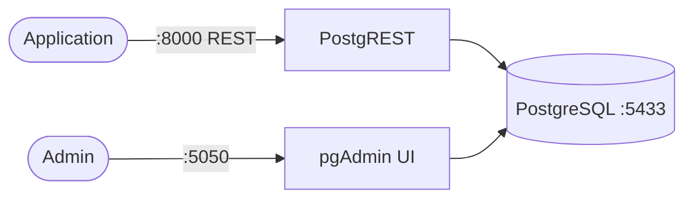

# Supabase

This stack provides a lightweight Supabase-style local foundation using PostgreSQL and PostgREST for instant REST APIs on top of PostgreSQL.

## How it works



1. `supabase-db` runs PostgreSQL.
2. `supabase-rest` (PostgREST) auto-generates REST endpoints from your database schema.
3. `supabase-ui` (pgAdmin) provides a web UI for browsing and managing PostgreSQL.
4. You connect apps to Postgres directly or use REST endpoints from PostgREST.

## Stack details in this repo

- Services:
  - `supabase-db` (`postgres:16`)
  - `supabase-rest` (`postgrest/postgrest:v12.2.3`)
  - `supabase-ui` (`dpage/pgadmin4:latest`)
- Ports:
  - Postgres: `localhost:5433`
  - REST API: `http://localhost:8000`
  - Web UI (pgAdmin): `http://localhost:5050`
- Persistent data:
  - `supabase_db_data:/var/lib/postgresql/data`
  - `supabase_ui_data:/var/lib/pgadmin`

## Environment variables

Set via `.env` (copy from `.env.example`):

- `SUPABASE_DB_PORT`
- `SUPABASE_DB_NAME`
- `SUPABASE_DB_USER`
- `SUPABASE_DB_PASSWORD`
- `SUPABASE_REST_PORT`
- `SUPABASE_DB_SCHEMAS`
- `SUPABASE_ANON_ROLE`
- `SUPABASE_JWT_SECRET`
- `SUPABASE_UI_PORT`
- `SUPABASE_UI_EMAIL`
- `SUPABASE_UI_PASSWORD`

## How to run

From the repository root:

```bash
cd supabase
cp .env.example .env
docker compose up -d
```

Open:

- REST root: `http://localhost:8000`
- Web UI: `http://localhost:5050`

### Use the web UI (pgAdmin)

1. Sign in with:
   - Email: value of `SUPABASE_UI_EMAIL`
   - Password: value of `SUPABASE_UI_PASSWORD`
2. Add server connection in pgAdmin:
   - Host: `supabase-db`
   - Port: `5432`
   - Username: value of `SUPABASE_DB_USER`
   - Password: value of `SUPABASE_DB_PASSWORD`
   - Database: value of `SUPABASE_DB_NAME`

Useful commands:

```bash
docker compose ps
docker compose logs -f
docker compose down
docker compose down -v
```

## Notes

- This is a lightweight Supabase-compatible starter, not the full official Supabase platform bundle.
- Create an `anon` DB role (or change `SUPABASE_ANON_ROLE`) before exposing REST endpoints to client apps.
