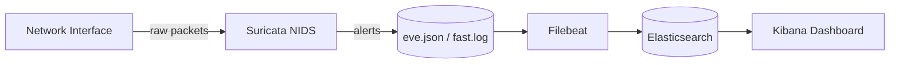
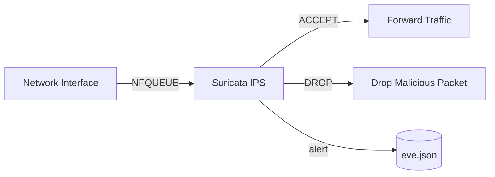

# Suricata

Suricata is a high-performance open-source Network Intrusion Detection System (NIDS), Network Intrusion Prevention System (NIPS), and Network Security Monitoring (NSM) engine. It inspects network traffic in real-time to detect and alert on malicious activity, policy violations, and anomalies.

## How Suricata works



1. Suricata captures raw packets from the network interface in AF_PACKET mode.
2. It decodes and reassembles traffic, then applies detection rules to identify threats.
3. Alerts and metadata are written to `eve.json` and `fast.log`.
4. Filebeat ships the logs to Elasticsearch for indexing and storage.
5. Kibana provides a web UI for visualizing and searching Suricata alerts.

## Stack details in this repo

- Suricata image: `jasonish/suricata:latest`
- Elasticsearch image: `docker.elastic.co/elasticsearch/elasticsearch:8.12.0`
- Kibana image: `docker.elastic.co/kibana/kibana:8.12.0`
- Filebeat image: `docker.elastic.co/beats/filebeat:8.12.0`
- Network mode: `host` (required for packet capture)
- Capabilities: `NET_ADMIN`, `NET_RAW`, `SYS_NICE`
- Container names: `suricata`, `suricata-es`, `suricata-kibana`, `suricata-filebeat`
- Ports:
  - `9200` — Elasticsearch API
  - `5601` — Kibana web UI
- Persistent volumes:
  - `suricata-logs` — Suricata log output
  - `suricata-run` — Suricata runtime socket
  - `es-data` — Elasticsearch data

## Required files

This stack requires the following files in the `suricata/` directory:

| File | Purpose |
|---|---|
| `suricata.yaml` | Main Suricata configuration (interfaces, outputs, rule paths, app-layer protocols) |
| `filebeat.yml` | Filebeat configuration to ship Suricata logs to Elasticsearch |
| `rules/` | Directory containing Suricata rule files (e.g. `suricata.rules`) |

### suricata.yaml

Key configuration sections:

- `vars.address-groups` — defines `HOME_NET` and `EXTERNAL_NET` (adjust to match your network)
- `af-packet` — packet capture interfaces (default: `eth0`, `eth1`)
- `outputs` — EVE JSON, fast log, and stats output configuration
- `app-layer.protocols` — enables deep packet inspection for HTTP, TLS, DNS, SSH, SMTP, and more
- `default-rule-path` — points to `/var/lib/suricata/rules`

### filebeat.yml

- Reads `eve.json` and `fast.log` from the Suricata log volume
- Ships logs to Elasticsearch at `http://elasticsearch:9200`
- Creates a `suricata-*` index pattern in Kibana

### rules/

Place Suricata rule files in this directory. You can download the Emerging Threats Open ruleset:

```bash
cd suricata/rules
curl -O https://rules.emergingthreats.net/open/suricata-7.0.0/emerging.rules.tar.gz
tar xzf emerging.rules.tar.gz
rm emerging.rules.tar.gz
```

Then update `suricata.yaml` to include the rule files:

```yaml
rule-files:
  - suricata.rules
  - emerging.rules
```

## Environment variables

No `.env` file is required. Configuration is handled through:

- `suricata.yaml` — Suricata engine settings
- `filebeat.yml` — Log shipping settings
- `docker-compose.yml` — container orchestration

## How to run

From the repository root:

```bash
cd suricata
docker compose up -d
```

Open:

- Kibana dashboard: `http://localhost:5601`
- Elasticsearch API: `http://localhost:9200`

Useful commands:

```bash
docker compose ps
docker compose logs -f suricata
docker compose logs -f filebeat
docker compose restart
docker compose down
```

## Detailed requirements

### Network interface

Suricata must capture from the correct network interface. The default config uses `eth0`. Find your interface:

```bash
ip link show
```

Update `suricata.yaml` and `docker-compose.yml` to match your interface name.

### HOME_NET configuration

Adjust `HOME_NET` in `suricata.yaml` to match your local network:

```yaml
vars:
  address-groups:
    HOME_NET: "[192.168.1.0/24]"
    EXTERNAL_NET: "!$HOME_NET"
```

### Rules

Suricata needs detection rules to generate alerts. Without rules, it will only log protocol metadata.

- **Emerging Threats Open** (free): <https://rules.emergingthreats.net/open/>
- **Snort VRT** (free registration): <https://www.snort.org/downloads>
- **Suricata ET Pro** (paid): <https://suricata.io/rules/>

Download and extract rules into the `rules/` directory, then reference them in `suricata.yaml`.

### System requirements

| Resource | Minimum | Recommended |
|---|---|---|
| CPU | 2 cores | 4+ cores |
| RAM | 4 GB | 8+ GB |
| Disk | 20 GB | 50+ GB SSD |
| Network | 1 Gbps | 10 Gbps for high-traffic networks |

### Kernel and capabilities

Suricata requires:

- `NET_ADMIN` — manage network interfaces
- `NET_RAW` — capture raw packets
- `SYS_NICE` — set thread priorities for performance

These are already set in `docker-compose.yml` via `cap_add`.

### Elasticsearch memory

The default `ES_JAVA_OPTS` is set to `-Xms1g -Xmx1g`. Adjust based on available RAM:

```yaml
environment:
  - "ES_JAVA_OPTS=-Xms2g -Xmx2g"
```

### File system permissions

Filebeat runs as `root` to read Suricata logs. Ensure the `suricata-logs` volume is accessible:

```bash
docker compose exec suricata ls -la /var/log/suricata/
```

## Use it effectively

- Start with the Emerging Threats Open ruleset for broad coverage.
- Tune `HOME_NET` and `EXTERNAL_NET` to reduce false positives.
- Use Kibana to create dashboards for alert trends, top talkers, and protocol breakdowns.
- Monitor Suricata stats in `eve.json` for dropped packets and performance issues.
- Set up email or webhook alerts for high-severity detections.
- Regularly update rules to stay current with new threats.

## IPS (Intrusion Prevention System) mode

By default, this stack runs Suricata in **IDS mode** — it only detects and alerts on malicious traffic. To actively **block** malicious packets, you need to run Suricata in **IPS mode** using NFQUEUE.

### How IPS mode works



1. `iptables` redirects incoming/outgoing packets to an NFQUEUE.
2. Suricata inspects each packet in the queue.
3. If a rule matches with a `drop` action, Suricata tells the kernel to drop the packet.
4. If no rule matches, the packet is accepted and forwarded normally.

### Step 1: Update docker-compose.yml

Add the `NET_ADMIN` capability (already present) and ensure `network_mode: host` is set. No other container changes are needed.

### Step 2: Configure iptables rules

Run these commands on the **host** (not inside the container) to redirect traffic through NFQUEUE:

```bash
# Redirect incoming traffic to Suricata NFQUEUE
sudo iptables -I INPUT -j NFQUEUE --queue-num 0

# Redirect outgoing traffic to Suricata NFQUEUE
sudo iptables -I OUTPUT -j NFQUEUE --queue-num 0

# For forwarded traffic (if routing/NAT is involved)
sudo iptables -I FORWARD -j NFQUEUE --queue-num 0
```

To make iptables rules persistent across reboots:

```bash
sudo apt install iptables-persistent
sudo netfilter-persistent save
```

### Step 3: Update suricata.yaml for IPS

Replace the `af-packet` section with an `nfqueue` section:

```yaml
nfqueue:
  - queue-number: 0
    queue-size: 10000
    bypass: no
```

Or use `af-packet` with inline mode:

```yaml
af-packet:
  - interface: eth0
    cluster-id: 99
    cluster-type: cluster_flow
    defrag: yes
    use-mmap: yes
    tpacket-v3: yes
    copy-mode: ips
    copy-iface: eth1
```

### Step 4: Use drop rules

IPS mode only blocks packets when rules use the `drop` action. The default rules in this repo use `alert`. To enable blocking, modify rules or use the `reject` action:

```yaml
# Example drop rule
drop tcp $EXTERNAL_NET any -> $HOME_NET 22 (msg:"BLOCK SSH Brute Force"; flow:to_server,established; content:"SSH-"; depth:4; threshold:type both, track by_src, count 5, seconds 60; sid:2001219; rev:5;)
```

You can also use `suricata-update` to download rulesets with drop actions:

```bash
docker compose exec suricata suricata-update
```

### Step 5: Restart and verify

```bash
docker compose restart suricata
docker compose logs -f suricata
```

Check that Suricata is running in IPS mode:

```bash
docker compose exec suricata suricata --build-info | grep NFQUEUE
```

Test with a known-bad packet:

```bash
# This should be blocked if a drop rule matches
nmap -sS -p 22 localhost
```

### IPS mode considerations

- **Performance**: IPS mode adds latency because every packet is inspected. Expect 10-30% throughput reduction.
- **False positives**: A false positive in IPS mode blocks legitimate traffic. Test thoroughly in IDS mode first.
- **Bypass**: Set `bypass: yes` in the NFQUEUE config to allow traffic to flow if Suricata crashes.
- **Docker networking**: NFQUEUE works with `network_mode: host`. For bridge mode, additional iptables rules are needed.
- **IPv6**: Add corresponding `ip6tables` rules if IPv6 is in use.

## Notes

- Suricata in IDS mode only alerts; it does not block traffic. For inline prevention (IPS mode), additional configuration is required.
- The `network_mode: host` is required for AF_PACKET capture but means Suricata sees all host traffic.
- Elasticsearch 8.x has security disabled by default in this stack. Enable authentication for production use.
- For high-traffic networks, consider tuning `ring-size`, `block-size`, and `cluster-type` in `af-packet`.
- Check `fast.log` for a quick text-based alert summary without needing Kibana.

## References

- Official site: <https://suricata.io>
- Documentation: <https://docs.suricata.io>
- GitHub repo: <https://github.com/OISF/suricata>
- Emerging Threats rules: <https://rules.emergingthreats.net/open/>
- Suricata rules documentation: <https://docs.suricata.io/en/latest/rules/>
- YouTube — Suricata IDS/IPS Setup: <https://www.youtube.com/watch?v=UXKbh0Kj0FE>
