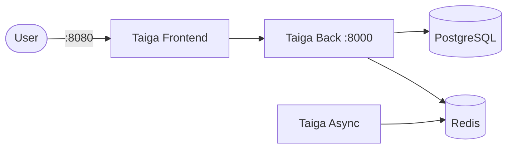

# Taiga

Taiga is an open-source agile project management platform (scrum/kanban, issues, wiki).

## How it works



1. Taiga Front serves the UI.
2. Taiga Back provides the REST API and core application.
3. Taiga Async runs background jobs via Celery.
4. Redis is used for the message broker/result backend.
5. PostgreSQL stores application data.

## Stack details in this repo

- Taiga Back image: `taigaio/taiga-back:latest`
- Taiga Front image: `taigaio/taiga-front:latest`
- PostgreSQL image: `postgres:13`
- Redis image: `redis:7`
- Taiga UI: `http://<host-ip>:8080`
- Taiga API: `http://<host-ip>:8000`
- Persistent data:
  - `taiga-db-data:/var/lib/postgresql/data`
  - `taiga-redis-data:/data`
  - `taiga-media:/taiga-back/media`

## Environment variables

This compose file is self-contained and currently hard-codes environment variables in `docker-compose.yml` (no `.env` required).

Important defaults in this stack:

- `TAIGA_SITES_DOMAIN`: `localhost:8080`
- `TAIGA_URL`: `http://localhost:8000`

## How to run

From the repository root:

```bash
cd taiga
docker compose up -d
```

If you use Podman:

```bash
cd taiga
podman compose up -d
```

Open:

- `http://localhost:8080`

## First login

If you don’t already have an admin user, create one:

```bash
cd taiga
docker compose exec taiga-back python manage.py createsuperuser
```

## Notes

- First startup can take a few minutes while services initialize.
