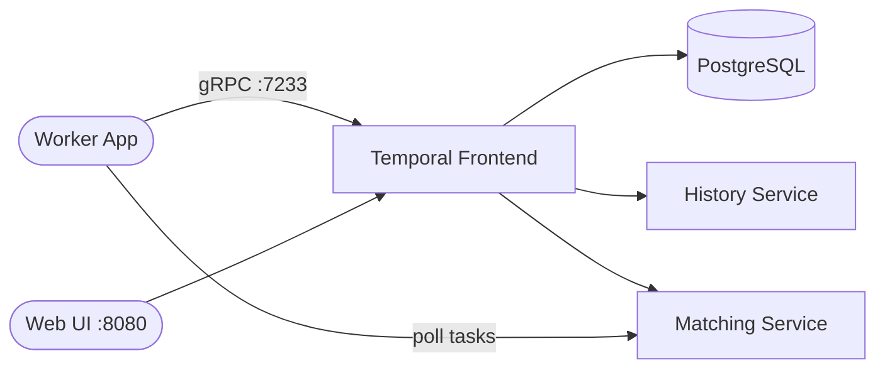

# Temporal

Temporal is a durable execution engine for building resilient, fault-tolerant
applications — reliable workflows, retries, timers, and state management for
microservices orchestration.

## How Temporal works



1. Worker applications connect to the Temporal frontend over gRPC on port 7233.
2. Workflow executions are durably persisted in PostgreSQL; tasks are dispatched to workers.
3. The Web UI on port 8080 shows workflows, executions, and history.

## Stack details in this repo

- Services: `postgresql`, `temporal`, `temporal-ui`
- Images: `docker.io/postgres:16`, `docker.io/temporalio/auto-setup:1.29.1`, `docker.io/temporalio/ui:2.34.0`
- Container names: `temporal-postgresql`, `temporal`, `temporal-ui`
- gRPC endpoint: `<host-ip>:7233`
- Web UI: `http://<host-ip>:8080`
- Persistent data:
  - `postgres-data:/var/lib/postgresql/data`

## Environment variables

- `DB=postgres12` — database driver
- `POSTGRES_SEEDS=postgresql`, `POSTGRES_USER=temporal`, `POSTGRES_PWD=temporal`
- `TEMPORAL_ADDRESS=temporal:7233` — server address
- `ENABLE_ES=false` — set to `true` (with `ES_SEEDS=elasticsearch`) to enable
  Elasticsearch-backed advanced visibility
- `DEFAULT_NAMESPACE=default`, `DEFAULT_NAMESPACE_RETENTION=24h`

## How to run

From the repository root:

```bash
cd temporal
docker compose up -d
```

Open `http://localhost:8080` for the Web UI. Point the Temporal CLI or an SDK
at `localhost:7233` to connect workers:

```bash
temporal operator cluster health --address localhost:7233
```

Useful commands:

```bash
docker compose ps
docker compose logs -f
docker compose restart
docker compose down
```

## Use it effectively

- Start workers with the SDK of your choice (Go, Java, Python, TypeScript, PHP, Ruby, .NET).
- Inspect running workflows, search history, and re-run failed executions in the Web UI.
- Scale workers horizontally — they all poll the same task queues.
- For advanced visibility, add an Elasticsearch service and set `ENABLE_ES=true`.

## Notes

- This is a single-node development/self-hosted setup; production deployments
  usually run a multi-node cluster with dedicated frontend/history/matching/worker services.
- The `auto-setup` image creates the schema and the `default` namespace on first start.
- Only the frontend gRPC port (7233) needs to be exposed for clients.
- See the [Temporal self-hosted guide](https://docs.temporal.io/self-hosted-guide) for details.

## References

- Documentation: <https://docs.temporal.io/>
- Self-hosted guide: <https://docs.temporal.io/self-hosted-guide>
- GitHub repo: <https://github.com/temporalio/temporal>
- Docker image: <https://hub.docker.com/r/temporalio/auto-setup>
- Web UI image: <https://hub.docker.com/r/temporalio/ui>
