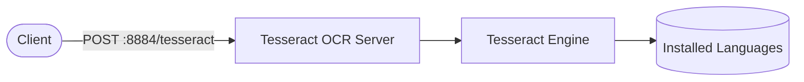

# Tesseract OCR API

Tesseract OCR API provides a stateless HTTP service wrapper for the Google Tesseract OCR engine. It allows you to run optical character recognition (OCR) on images and retrieve recognized text using standard HTTP requests.

## How it works



1. The Tesseract server starts an HTTP API wrapper on port `8884`.
2. On startup, the container installs any languages specified via the `TESSERACT_LANGUAGES` environment variable.
3. Clients send standard multipart `POST` requests to `/tesseract` containing image files.
4. The server runs OCR on the image and returns the recognized text in a JSON response.

## Stack details in this repo

- Image: `hertzg/tesseract-server:latest`
- Web API: `http://<host-ip>:8884` (or custom port via env)
- Persistent data: Optional mount `/usr/share/tessdata` if using custom trained models.

## Environment variables

Copy `.env.example` to `.env`:

- `TESSERACT_PORT` (default: `8884`)
- `TESSERACT_LANGUAGES` (comma-separated list of additional Alpine packages to install on startup, e.g. `jpn,ara,hin,deu,fra`)

## How to run

From the repository root:

```bash
cd tesseract
cp .env.example .env
docker compose up -d
```

If you use Podman:

```bash
cd tesseract
cp .env.example .env
podman compose up -d
```

### Test endpoint

You can test the OCR endpoint by sending an image using `curl`:

```bash
curl -F "file=@your_image.png" http://localhost:8884/tesseract
```

To specify custom options like specific language or OCR engine mode, pass an `options` JSON string parameter:

```bash
curl -F "options={\"languages\":[\"eng\"]}" -F "file=@your_image.png" http://localhost:8884/tesseract
```

### Useful commands:

```bash
docker compose ps
docker compose logs -f
docker compose restart
docker compose down
```

## Notes

- **Stateless**: The container is completely stateless. No volume mounts are required unless you wish to load custom `.traineddata` files.
- **Resource Usage**: OCR can be CPU intensive; make sure to monitor container resource usage if processing a large volume of images.
- **Language Codes**: Supported languages correspond to standard Alpine Linux `tesseract-ocr-data-*` package names.
