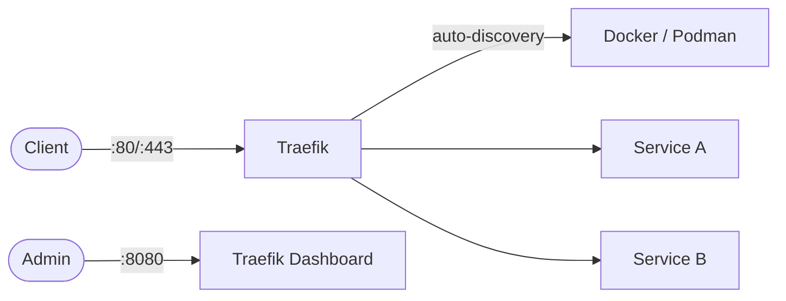

# Traefik

Traefik is a modern reverse proxy and ingress controller with automatic service discovery.

## How it works



1. Traefik watches Docker/Podman labels on running containers.
2. Routes are created dynamically based on labels.
3. HTTP/HTTPS traffic is forwarded to target services.
4. Dashboard helps inspect routers, services, and middleware.

## Stack details in this repo

- Image: `traefik:v3.1`
- Ports: `80`, `443`, dashboard `8080`
- Socket mapping:
  - Docker: `/var/run/docker.sock`
  - Podman: `/var/run/podman/podman.sock` (set in `.env`)

## Environment variables

- `TRAEFIK_HTTP_PORT`
- `TRAEFIK_HTTPS_PORT`
- `TRAEFIK_DASHBOARD_PORT`
- `TRAEFIK_SOCKET`

## How to run

```bash
cd traefik
cp .env.example .env
docker compose up -d
```

Podman socket example:

```bash
TRAEFIK_SOCKET=/var/run/podman/podman.sock podman compose up -d
```

## Notes

- Dashboard is enabled with insecure mode for local usage.
- For production, secure dashboard and configure TLS/certificates.
