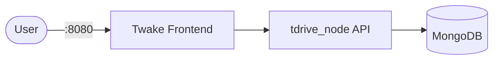

# Twake Drive

Twake Drive is a self-hosted file storage and collaboration platform.  
This setup runs the backend node service, frontend web app, and MongoDB database.

## How it works



1. `frontend` serves the web interface.
2. `tdrive_node` handles API/business logic and file operations.
3. `mongo` stores application data/metadata.
4. Shared volumes persist uploads, previews, logs, and certificates.

## Stack details in this repo

- MongoDB image: `mongo`
- Twake node image: `twakedrive/tdrive-node`
- Twake frontend image: `twakedrive/tdrive-frontend`
- Ports:
  - HTTP: `8080:80`
  - HTTPS: `4433:443`
- Persistent paths:
  - `mongo-data:/data/db`
  - `./docker-data/documents/:/storage/`
  - `./docker-data/logs/nginx/:/var/log/nginx`
  - `./docker-data/letsencrypt/:/etc/letsencrypt/`
  - `./docker-data/drive-preview/:/tdrive-core/web/medias/`
  - `./docker-data/uploads/:/tdrive-core/web/upload/`
- Network: `tdrive_network` (bridge)

## Environment variables

This compose file sets service variables inline (for example `DEV`, `DB_DRIVER`, `SEARCH_DRIVER`, `NODE_HOST`, `SSL_CERTS`) and does not require a `.env` by default.

## How to run

From the repository root:

```bash
cd twake/drive
docker compose up -d
```

Open:

- HTTP: `http://localhost:8080`
- HTTPS: `https://localhost:4433`

Useful commands:

```bash
docker compose ps
docker compose logs -f
docker compose restart
docker compose down
```

## Use it effectively

- Start on HTTP first (`SSL_CERTS=off`) for easier local setup.
- Use HTTPS mode when you need secure browser behavior and cert testing.
- Persist `docker-data` folders to keep user files and generated data.

## Notes

- First startup may take time while services initialize.
- If HTTPS is enabled with self-signed certificates, browser trust warnings are expected.
