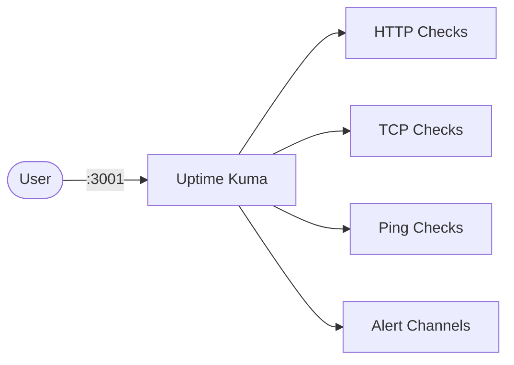

# Uptime Kuma

Uptime Kuma is a self-hosted uptime monitoring tool with a web UI, status pages, and alert notifications.  
Use it to monitor websites, APIs, TCP ports, DNS, and other services.

## How it works



1. Uptime Kuma starts a web interface and monitoring scheduler.
2. You add monitors (HTTP, ping, TCP, etc.) from the UI.
3. Kuma runs checks at configured intervals.
4. Alert channels (email, Discord, Slack, Telegram, etc.) are triggered on failures/recovery.

## Stack details in this repo

- Image: `louislam/uptime-kuma:1`
- Container name: `uptime-kuma`
- Web UI: `http://<host-ip>:3001` (or custom port via env)
- Persistent data:
  - `./data:/app/data`

## Environment variables

Copy `.env.example` to `.env`:

- `UPTIME_KUMA_PORT` (default: `3001`)

## How to run

From the repository root:

```bash
cd uptime-kuma
cp .env.example .env
docker compose up -d
```

If you use Podman:

```bash
cd uptime-kuma
cp .env.example .env
podman compose up -d
```

Open:

- `http://localhost:3001` (or your configured port)

On first access, create your admin account.

Useful commands:

```bash
docker compose ps
docker compose logs -f
docker compose restart
docker compose down
```

## Use it effectively

- Add monitors for critical services first (reverse proxy, DB, CI, DNS).
- Configure at least one alert channel before relying on checks.
- Use a public status page for external service transparency.

## Notes

- Keep `./data` backed up to preserve monitor history and settings.
- Port conflicts on `3001` can be resolved by changing `UPTIME_KUMA_PORT` in `.env`.
