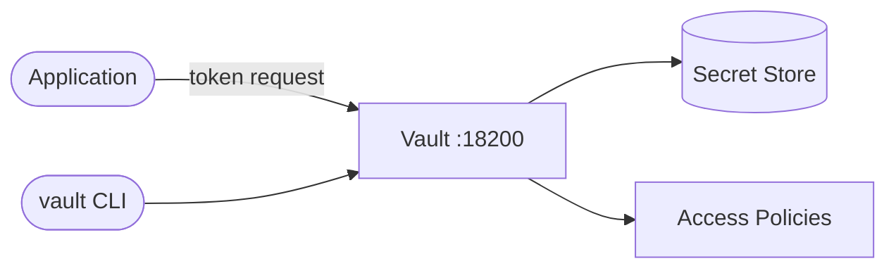

# HashiCorp Vault

Vault is a secrets management and data protection platform for securely storing and accessing sensitive information such as API keys, passwords, and certificates.

## How it works



1. Vault starts as a secure secrets API service.
2. Applications authenticate to Vault using supported auth methods.
3. Vault enforces policy-based access control for secrets.
4. Clients read/write secrets through Vault HTTP API or CLI.

## Stack details in this repo

- Image: `hashicorp/vault:latest`
- Container name: `vault`
- API/UI endpoint: `http://<host-ip>:18200` (default host mapping)
- Port mapping:
  - `${VAULT_PORT:-18200}:8200`
- Capability:
  - `IPC_LOCK` (helps prevent secrets from being swapped to disk)
- Mode:
  - `server -dev` (development mode)

## Environment variables

Copy `.env.example` to `.env`:

- `VAULT_PORT` (default: `18200`)
- `VAULT_DEV_ROOT_TOKEN_ID` (default: `root`)

## How to run

From the repository root:

```bash
cd vault
cp .env.example .env
docker compose up -d
```

If you use Podman:

```bash
cd vault
cp .env.example .env
podman compose up -d
```

Open:

- `http://localhost:18200`

Use token:

- Value from `VAULT_DEV_ROOT_TOKEN_ID` (default: `root`)

## Useful commands

```bash
docker compose ps
docker compose logs -f
docker compose restart
docker compose down
```

## Notes

- This stack is configured for **development mode only**.
- Dev mode is not suitable for production because it auto-initializes and uses simplified security settings.
- For production, use a proper storage backend (for example Raft), TLS, unseal workflow, and strict policy/auth setup.
- If host port `8200` is already used by another local Vault process, keep using `18200` (or any free port) in `.env`.
