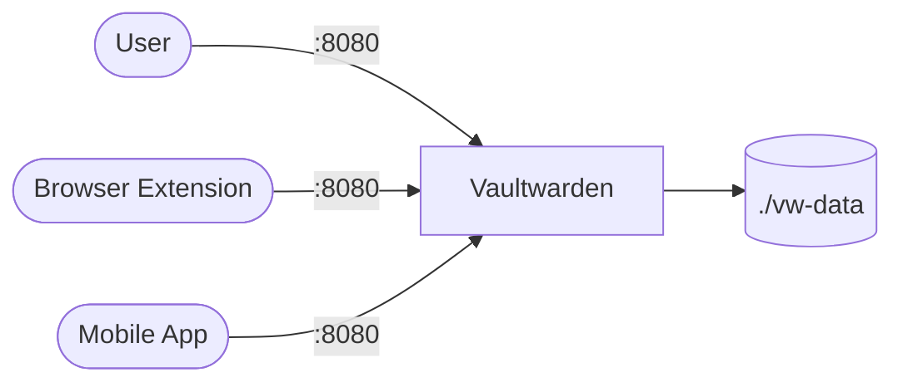

# Vaultwarden

Vaultwarden is an unofficial, open-source server implementation of Bitwarden. It provides a self-hosted password manager with browser extensions, mobile apps, and a web vault.

## How Vaultwarden works



1. Vaultwarden serves a web vault and REST API on port 80 (mapped to host port 8080).
2. All vault data (logins, notes, cards) is stored in `./vw-data`.
3. Browser extensions and mobile apps sync with the server over HTTPS.
4. WebSocket support enables real-time sync across connected clients.

## Stack details in this repo

- Image: `vaultwarden/server:latest`
- Container name: `vaultwarden`
- Port: `8080:80`
- Persistent data: `./vw-data:/data`
- WebSocket: enabled (`WEBSOCKET_ENABLED=true`)
- Signups: allowed by default (`SIGNUPS_ALLOWED=true`)

## Environment variables

Configured directly in `docker-compose.yml`:

- `WEBSOCKET_ENABLED` — set to `true` for real-time sync (default: `true`)
- `SIGNUPS_ALLOWED` — set to `false` after creating your account to block public signups (default: `true`)

Additional environment variables can be added for admin panel, SMTP, and more. See the [Vaultwarden wiki](https://github.com/dani-garcia/vaultwarden/wiki/Environment-variables) for the full list.

## How to run

From the repository root:

```bash
cd vaultwarden
docker compose up -d
```

Open:

- Web vault: `http://localhost:8080`

Useful commands:

```bash
docker compose ps
docker compose logs -f
docker compose restart
docker compose down
```

## Use it effectively

- Create your account at `http://localhost:8080`.
- Set `SIGNUPS_ALLOWED=false` in `docker-compose.yml` and restart to prevent others from registering.
- Install the Bitwarden browser extension and mobile app, then point them to your server URL.
- Enable the admin panel by setting an `ADMIN_TOKEN` for user management and diagnostics.
- Back up the `./vw-data` directory regularly.

## Notes

- For production, place Vaultwarden behind a reverse proxy (e.g. Caddy, Nginx Proxy Manager) with TLS.
- The `latest` tag tracks the most recent release; pin a specific version for stability.
- Vaultwarden is lightweight and runs well on low-resource hardware (Raspberry Pi, small VPS).

## References

- Official site: <https://github.com/dani-garcia/vaultwarden>
- Documentation: <https://github.com/dani-garcia/vaultwarden/wiki>
- Docker Hub image: <https://hub.docker.com/r/vaultwarden/server>
- Bitwarden clients: <https://bitwarden.com/download/>
