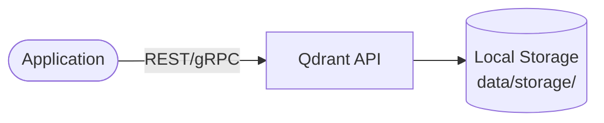
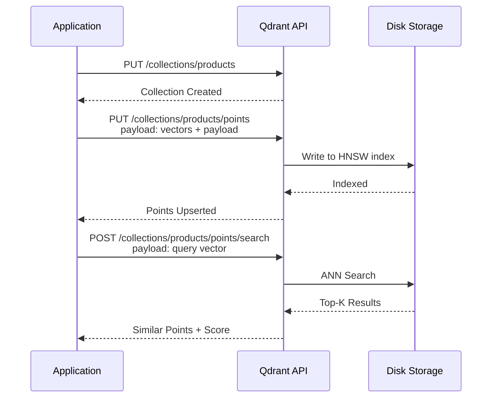

# VectorDB (Qdrant)

Qdrant is a vector similarity search engine and vector database written in Rust.  
It provides a production-ready service for storing, managing, and searching high-dimensional vectors with a rich API.

## How it works





1. Application connects to Qdrant via REST API (port `6333`) or gRPC (port `6334`).
2. Vectors are stored with optional payload (metadata) and indexed using HNSW for fast approximate nearest neighbor search.
3. Queries return the most similar vectors along with their payload and similarity score.

## Stack details in this repo

- Image: `qdrant/qdrant:latest`
- REST API: `http://localhost:6333`
- gRPC API: `localhost:6334`
- Web UI: `http://localhost:6333/dashboard`
- Persistent data:
  - `./data/storage/` — vector index and database files
  - `./data/snapshots/` — collection snapshots

## Environment variables

Qdrant runs with sensible defaults. Optional variables can be set via `.env`:

| Variable | Default | Description |
|----------|---------|-------------|
| `QDRANT__SERVICE__GRPC_PORT` | `6334` | gRPC port |
| `QDRANT__SERVICE__HTTP_PORT` | `6333` | REST API port |
| `QDRANT__LOG_LEVEL` | `INFO` | Log verbosity |

## How to run

From the repository root:

```bash
cd vectordb
docker compose up -d
```

Open the dashboard:

```text
http://localhost:6333/dashboard
```

Useful commands:

```bash
docker compose ps
docker compose logs -f
docker compose down
docker compose down -v
```

## How to use

### Create a collection

```bash
curl -X PUT http://localhost:6333/collections/products \
  -H "Content-Type: application/json" \
  -d '{
    "vectors": {
      "size": 768,
      "distance": "Cosine"
    }
  }'
```

### Upsert points

```bash
curl -X PUT http://localhost:6333/collections/products/points \
  -H "Content-Type: application/json" \
  -d '{
    "points": [
      {
        "id": 1,
        "vector": [0.1, 0.2, 0.3, 0.4],
        "payload": {"name": "laptop", "price": 999}
      }
    ]
  }'
```

### Search

```bash
curl -X POST http://localhost:6333/collections/products/points/search \
  -H "Content-Type: application/json" \
  -d '{
    "vector": [0.1, 0.2, 0.3, 0.4],
    "limit": 5
  }'
```

## Notes

- The dashboard is available at `/dashboard` on the REST API port — useful for inspecting collections and points.
- Snapshots in `./data/snapshots/` can be used for backup and restore across instances.
- For production, consider setting `QDRANT__SERVICE__API_KEY` to secure the API.
