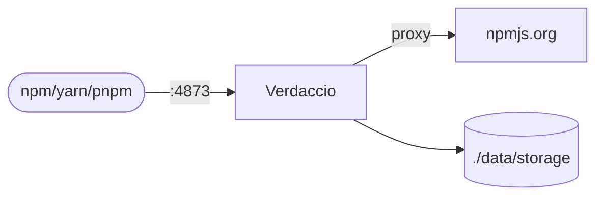

# Verdaccio

Verdaccio is a lightweight private npm registry for package caching and internal package publishing.

## How it works



1. Verdaccio serves npm-compatible registry APIs.
2. Teams can publish private packages and proxy npmjs.org.
3. npm/yarn/pnpm clients point to Verdaccio registry URL.
4. Package storage/config persist in mounted volumes.

## Stack details in this repo

- Image: `verdaccio/verdaccio:latest`
- Container name: `verdaccio`
- Endpoint: `http://<host-ip>:4873`
- Persistent data:
  - `./data/storage:/verdaccio/storage`
  - `./data/conf:/verdaccio/conf`

## Environment variables

Copy `.env.example` to `.env`:

- `VERDACCIO_PORT` (default: `4873`)

## How to run

```bash
cd verdaccio
cp .env.example .env
docker compose up -d
```

Podman:

```bash
cd verdaccio
cp .env.example .env
podman compose up -d
```

## Notes

- Default config is provided at `data/conf/config.yaml`.
- Use scoped registries in npm config for best control.
