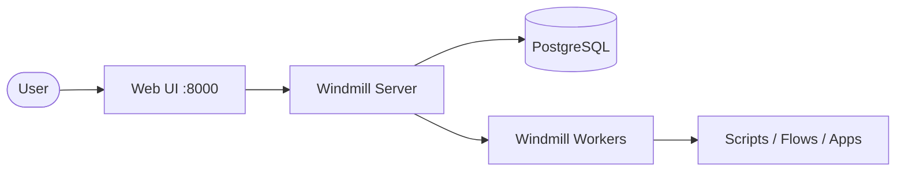

# Windmill

Windmill is an open-source developer platform to turn scripts, queries, and
APIs into workflows and internal tools — an alternative to n8n, Retool,
and Airplane.

## How Windmill works



1. Users build scripts, flows, and internal apps in the web UI on port 8000.
2. The server schedules jobs and stores state in PostgreSQL.
3. Workers execute jobs written in Python, TypeScript, Go, Bash, SQL, or REST.

## Stack details in this repo

- Services: `db` (PostgreSQL), `windmill_server`, `windmill_worker`
- Images: `docker.io/postgres:16`, `ghcr.io/windmill-labs/windmill:main`
- Web UI: `http://<host-ip>:8000`
- Persistent data:
  - `db_data:/var/lib/postgresql/data`
  - `worker_dependency_cache:/tmp/windmill/cache`
  - `worker_logs:/tmp/windmill/logs`

## Environment variables

- `DATABASE_URL` — PostgreSQL connection string (defaults to the `db` service)
- `MODE` — `server` or `worker`
- `WORKER_GROUP` — worker group name (default: `default`)
- `FAVOR_UNSHARE_PID` — enables PID namespace isolation for jobs

## How to run

From the repository root:

```bash
cd windmill
docker compose up -d
```

Open `http://localhost:8000` and sign in with the default credentials
`admin@example.com` / `admin`.

Useful commands:

```bash
docker compose ps
docker compose logs -f
docker compose restart
docker compose down
```

## Use it effectively

- Write scripts in Python, TypeScript, Go, Bash, SQL, or REST and chain them into flows.
- Build low-code internal apps (UIs) on top of your scripts.
- Trigger jobs via cron schedules, the REST API, or webhooks.
- Scale job execution by adding more workers:

  ```bash
  docker compose up -d --scale windmill_worker=3
  ```

## Notes

- This is a simplified stack; the official compose also runs Caddy on port 80,
  an LSP service, and specialized workers — see the
  [official docker-compose.yml](https://github.com/windmill-labs/windmill/blob/main/docker-compose.yml).
- The worker runs with `privileged: true` for PID namespace isolation; remove it
  if your environment forbids privileged containers.
- Sandboxed jobs run daemonless (crane + nsjail) inside the worker — no Docker
  socket required. Only mount `/var/run/docker.sock` for the legacy full-compat
  `# docker` mode, which grants scripts full host access.
- See the [Windmill documentation](https://www.windmill.dev/docs) for full configuration.

## References

- Official site: <https://www.windmill.dev>
- Documentation: <https://www.windmill.dev/docs>
- GitHub repo: <https://github.com/windmill-labs/windmill>
- Docker image: <https://github.com/windmill-labs/windmill/pkgs/container/windmill>
