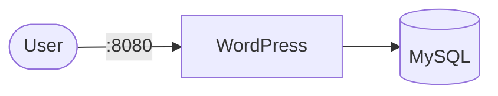

# WordPress

This setup runs a single-node WordPress instance paired with a MySQL 8 database for local development.

## How it works



1. The db container initializes the MySQL database.

2. The wordpress container starts and waits for the database to be ready.

3. WordPress connects to the database using the credentials provided in the environment variables.

4. HTTP interface is exposed on port 8080.

## Stack details in this repo

- Images: wordpress:latest, mysql:8.0
- Container names: wordpress, db
- Ports:
  - 8080:80 (HTTP)
- Persistent data:
  - wordpress:/var/www/html
  - db:/var/lib/mysql

## How to run

From the repository root:

```bash
podman-compose up -d
```

Access the application in your browser:
`http://localhost:8080`

## Useful commands

```bash
podman-compose ps
podman-compose logs -f
podman-compose restart

# Use -v to wipe database and files if you need a fresh start
podman-compose down -v
```

## Notes

- **Initial Setup**: On the first run, the database takes 30-60 seconds to initialize. If you see "Error establishing a database connection," wait a moment and refresh.

- **MySQL 8 Compatibility**: This setup uses `--default-authentication-plugin=mysql_native_password` to ensure compatibility with WordPress.

- **Persistence**: All data is saved in named volumes. To reset the installation (e.g., to change database credentials), you must run `podman-compose down -v` to delete the volumes.
