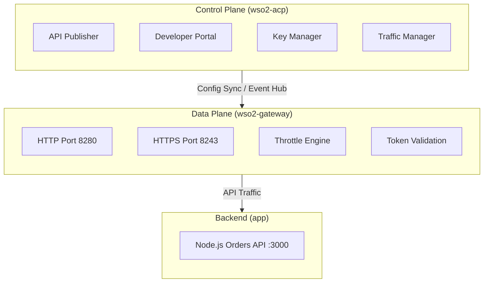
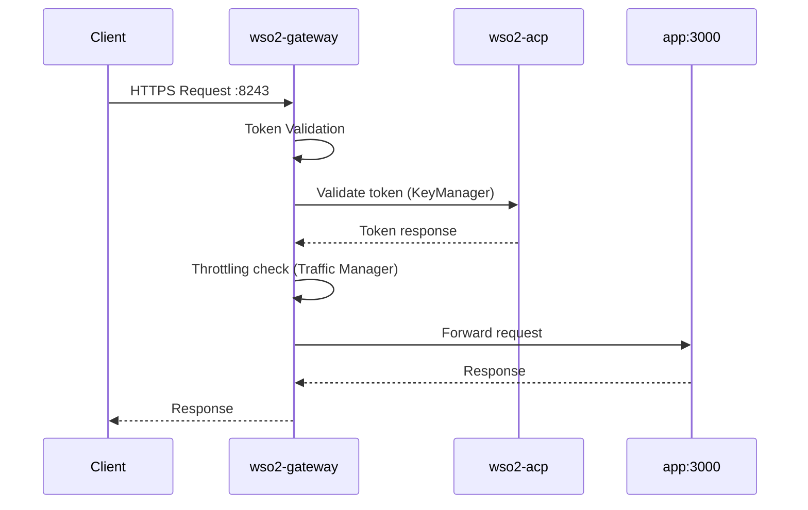
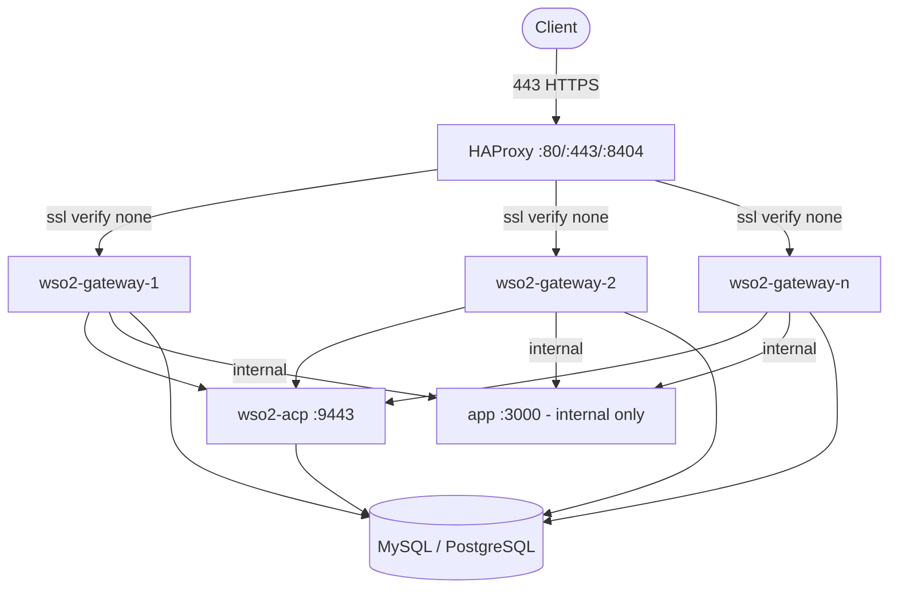

# WSO2 API Manager with Separate Gateway Runtime

This Docker Compose setup demonstrates a **WSO2 API Manager 4.7.0** deployment with a **separate Gateway runtime**, similar to the **IBM API Connect / DataPower** architecture pattern where the control plane (ACP - API Control Plane) is decoupled from the data plane (gateway runtime).

## Architecture



## Traffic Flow



## Components

| Component | Image | Ports | Description |
|-----------|-------|-------|-------------|
| **wso2-acp** | `wso2/wso2am-acp:4.7.0` | 9443 (HTTPS), 9763 (HTTP) | Control Plane (ACP) - API Publisher, Developer Portal, Key Manager, Traffic Manager |
| **wso2-gateway** | `wso2/wso2am-universal-gw:4.7.0` | 8280 (HTTP), 8243 (HTTPS) | Universal Gateway Runtime - Handles API traffic, throttling, token validation |
| **app** | Custom Node.js | 3000 *(internal - remove `ports` in prod)* | Sample backend service (reachable only via gateway in production) |

## Quick Start

### Prerequisites
- Docker Desktop or Docker Engine 20.10+
- Docker Compose 2.0+
- At least 4GB RAM available for containers

### Start the Stack

```bash
docker compose up -d
```

> The `wso2-gateway` waits for `wso2-acp` to pass its healthcheck before starting. The `wso2-acp` healthcheck checks `https://localhost:9443/carbon/admin/login.jsp` with a 60s start period.

### Verify Services

```bash
# Check container status
docker compose ps

# View logs
docker compose logs -f wso2-acp
docker compose logs -f wso2-gateway
docker compose logs -f app
```

### Access URLs

| Service | URL | Credentials |
|---------|-----|-------------|
| **API Publisher** | https://localhost:9443/publisher | admin / admin |
| **Developer Portal** | https://localhost:9443/devportal | admin / admin |
| **Admin Console** | https://localhost:9443/carbon | admin / admin |
| **Gateway (HTTPS)** | https://localhost:8243 | - |
| **Gateway (HTTP)** | http://localhost:8280 | - |
| **Backend API** | http://localhost:3000/api/orders | - |

> **Note:** `wso2-acp` replaces the former `wso2-am` service and `wso2/wso2am` image. The gateway now uses the `wso2/wso2am-universal-gw` image.

## Configuration

### Control Plane (`conf/acp/deployment.toml`)

The control plane (ACP) runs with all profiles enabled:
- **Publisher** - API lifecycle management
- **Developer Portal** - API consumption and subscription
- **Key Manager** - OAuth2/OIDC token management
- **Traffic Manager** - Throttling and analytics
- **Gateway** - Embedded (but we use separate universal gateway)

Key configurations:
- Database: H2 (embedded) for simplicity
- Gateway Environment: "Default" (hybrid type)
- CORS: Enabled for all origins
- JWT Token Issuer: Extended JWT
- Java opts: `-Xms512m -Xmx2g` (defined in docker-compose.yml)

### Gateway Runtime (`conf/gateway/deployment.toml`)

The gateway runs in **gateway-only profile** connecting to the control plane (wso2-acp):
- **Service URL**: Points to `wso2-acp:9443/services/`
- **Key Manager**: Connects to control plane for token validation
- **Throttling**: Connects to control plane's Traffic Manager (JMS/TCP)
- **Event Sync**: Receives deployment events from control plane

Key configurations:
- Gateway Type: Universal Gateway
- Environment: Production
- Ports: HTTP 8280, HTTPS 8243
- Token Cache: Enabled (15 min TTL)
- Throttling: Enabled with load-balanced TM endpoints
- Java opts: `-Xms512m -Xmx1g` (defined in docker-compose.yml)

## API Deployment

### Option 1: Via Publisher UI (Recommended)

1. Login to Publisher: https://localhost:9443/publisher
2. Create new REST API → "Orders API"
3. Context: `/orders`
4. Backend: `http://app:3000`
5. Deploy to "Default" gateway environment
6. Subscribe via Developer Portal
7. Invoke via Gateway: `curl -k -H "Authorization: Bearer <token>" https://localhost:8243/orders/1.0.0/orders/1`

### Option 2: Via Artifacts (Synapse Config)

Pre-defined API artifact in `artifacts/api/OrderAPI.xml`:
- This is a Micro Integrator style synapse config
- For API Manager Gateway, use Publisher UI or REST API

### Option 3: Via REST API (CI/CD)

```bash
# Create API via REST API
curl -k -X POST -u admin:admin \
  -H "Content-Type: application/json" \
  -d '{"name":"OrdersAPI","context":"/orders","version":"1.0.0","provider":"admin","endpointConfig":"{\"production_endpoints\":{\"url\":\"http://app:3000\"},\"sandbox_endpoints\":{\"url\":\"http://app:3000\"}}","endpointSecurity":"none"}' \
  https://localhost:9443/api/am/publisher/v4/apis
```

## Testing the Gateway

### 1. Health Check
```bash
curl -k https://localhost:8243/services/echo
```

### 2. Get Token (Client Credentials)
```bash
# First create application in Dev Portal, then:
curl -k -X POST \
  -H "Authorization: Basic <base64(client_id:client_secret)>" \
  -H "Content-Type: application/x-www-form-urlencoded" \
  -d "grant_type=client_credentials" \
  https://localhost:8243/token
```

### 3. Invoke API via Gateway
```bash
curl -k -H "Authorization: Bearer <access_token>" \
  https://localhost:8243/orders/1.0.0/orders/1
```

Expected response:
```json
{"id":1,"product":"Laptop","amount":1200}
```

## API Connect / DataPower Comparison

| Aspect | IBM API Connect / DataPower | WSO2 ACP + Universal Gateway |
|--------|----------------------------|-------------------------------|
| **Control Plane** | API Manager (Management, Portal, Catalog) | WSO2 ACP (Publisher, DevPortal, KeyManager) |
| **Data Plane** | DataPower Gateway | WSO2 Universal Gateway |
| **Sync Mechanism** | Management plane → Gateway via config sync | Event-driven deployment sync + JMS for throttling |
| **Token Validation** | DataPower validates against OAuth server | Gateway validates via KeyManager service calls + cache |
| **Throttling** | DataPower local + centralized | Gateway local + Traffic Manager (JMS) |
| **Protocol Support** | HTTP, HTTPS, MQ, TCP, etc. | HTTP, HTTPS, WebSocket, gRPC, GraphQL |

## Production Considerations

### Databases
Replace H2 with production databases (MySQL or PostgreSQL recommended). Both `wso2-acp` and `wso2-gateway` share the same databases:

```toml
# conf/acp/deployment.toml
[database.apim_db]
type = "postgre"
hostname = "postgres"
name = "apim_db"
port = "5432"
username = "apim_user"
password = "secure_password"

[database.shared_db]
type = "postgre"
hostname = "postgres"
name = "shared_db"
port = "5432"
username = "apim_user"
password = "secure_password"
```

### Domain & SSL

In production, expose the gateway behind a proper domain with TLS. The gateway's `8243` port is the public-facing API port — it receives all client requests. Port `3000` (the backend `app`) should be **internal only** — remove or restrict its `ports` mapping so it is reachable only from the gateway.

#### DNS

Set up A records for your domain(s):

| Service | DNS Record |
|---------|-----------|
| Gateway (API traffic) | `api.example.com` → `<host-ip>` |
| API Publisher | `publisher.example.com` → `<host-ip>` |
| Developer Portal | `devportal.example.com` → `<host-ip>` |

Update the gateway environment endpoints in `conf/acp/deployment.toml` to use your domain:

```toml
[[apim.gateway.environment]]
name = "Default"
type = "hybrid"
display_in_api_console = true
description = "Production gateway"
show_as_token_endpoint_url = true
service_url = "https://wso2-gateway:9443/services/"
ws_endpoint = "ws://wso2-gateway:9099"
wss_endpoint = "wss://wso2-gateway:8099"
http_endpoint = "http://wso2-gateway:8280"
https_endpoint = "https://api.example.com"
```

#### Option A — TLS at HAProxy (Recommended)

Terminate SSL at the reverse proxy. WSO2 services stay on HTTP internally, simplifying keystore management.

1. **Prepare the certificate** (combine full chain + key into a single PEM):
   ```bash
   cat fullchain.pem privkey.pem > api.example.com.pem
   ```
2. **Use HAProxy** (see the HAProxy section below) with:
   ```
   frontend https_front
       bind *:443 ssl crt /etc/haproxy/certs/api.example.com.pem
       # redirect HTTP → HTTPS (see HAProxy section)
   ```
3. **Backend connections** from HAProxy to gateway use `ssl verify none` since WSO2 uses self-signed internally.

#### Option B — TLS at WSO2 (Passthrough)

If compliance requires end-to-end TLS, configure WSO2's keystore with your certificate:

```bash
# Convert PEM to PKCS12, then import into JKS
openssl pkcs12 -export -in fullchain.pem -inkey privkey.pem \
  -out wso2carbon.p12 -name wso2carbon
keytool -importkeystore -srckeystore wso2carbon.p12 -srcstoretype PKCS12 \
  -destkeystore conf/acp/wso2carbon.jks -deststoretype JKS
keytool -importkeystore -srckeystore wso2carbon.p12 -srcstoretype PKCS12 \
  -destkeystore conf/gateway/wso2carbon.jks -deststoretype JKS
```

Then configure HAProxy in TCP mode:
```
frontend https_front
    bind *:443
    default_backend gw_back

backend gw_back
    mode tcp
    balance source
    server gw1 wso2-gateway:8243 check inter 5s fall 3 rise 2
```

#### Certificate Renewal (Let's Encrypt)

```bash
# Obtain cert
certbot certonly --standalone -d api.example.com -d publisher.example.com -d devportal.example.com

# Auto-renew via cron
0 3 * * * certbot renew --quiet --post-hook "docker compose -f /path/to/docker-compose.yml restart haproxy"
```

#### Verify SSL

```bash
curl -v https://api.example.com/health
openssl s_client -connect api.example.com:443 -servername api.example.com | openssl x509 -noout -dates -issuer
```

### High Availability with HAProxy

Run multiple `wso2-gateway` replicas behind HAProxy for load balancing and failover.

#### Architecture



#### HAProxy Configuration

```haproxy
# haproxy/haproxy.cfg
global
    log stdout format raw local0

defaults
    log     global
    mode    http
    option  httplog
    timeout connect 5s
    timeout client  30s
    timeout server  30s

# Redirect HTTP → HTTPS
frontend http_front
    bind *:80
    http-request redirect scheme https code 301 if !{ ssl_fc }

# HTTPS frontend with TLS termination
frontend https_front
    bind *:443 ssl crt /etc/haproxy/certs/
    default_backend gw_back

# Gateway backend — multiple replicas
backend gw_back
    balance leastconn
    option httpchk GET /services/echo
    http-check expect status 200
    server gw1 wso2-gateway-1:8243 check ssl verify none inter 5s fall 3 rise 2
    server gw2 wso2-gateway-2:8243 check ssl verify none inter 5s fall 3 rise 2

# Stats dashboard
listen stats
    bind *:8404
    stats enable
    stats uri /stats
    stats refresh 10s
    stats auth admin:admin
```

#### Docker Compose Override

Create `docker-compose.override.yml` (or add the `haproxy` service to your main compose):

```yaml
# docker-compose.override.yml
services:
  haproxy:
    image: haproxy:2.9-alpine
    container_name: haproxy
    ports:
      - "80:80"
      - "443:443"
      - "8404:8404"
    volumes:
      - ./haproxy/haproxy.cfg:/usr/local/etc/haproxy/haproxy.cfg:ro
      - ./certs:/etc/haproxy/certs:ro
    restart: unless-stopped
    networks:
      - wso2-network
    depends_on:
      wso2-gateway:
        condition: service_healthy
```

#### Scaling Gateways

Remove `container_name` from `wso2-gateway` in `docker-compose.yml` (or use `docker-compose.override.yml`), then scale:

```bash
docker compose up -d --scale wso2-gateway=3
```

**Important:** When running multiple gateway replicas:
- Add `[apim.throttling]` block in `conf/gateway/deployment.toml` pointing to a shared Traffic Manager (JMS) instead of local in-memory throttling (see `conf/gateway/deployment.toml:59-63`)
- Use a shared database (configured above) so all replicas share state
- The `depends_on` condition `service_healthy` ensures HAProxy only routes to healthy replicas

#### Verify HA

```bash
# Check all gateway instances are registered
echo show stat | socat stdio tcp:localhost:8404 | cut -d, -f1,2,18,37

# Test through HAProxy
curl -k https://api.example.com/orders/1.0.0/orders/1 \
  -H "Authorization: Bearer <access_token>"

# HAProxy stats dashboard
# Open http://localhost:8404/stats  (login: admin / admin)
```

### Security
- Use proper certificates (not self-signed) — see Domain & SSL section
- Enable mutual TLS for service-to-service communication
- Configure WAF rules in front of HAProxy
- Change default credentials (`admin/admin`) immediately
- Restrict `app` port `3000` to internal network only (remove `ports` or bind to `127.0.0.1`)

### Monitoring
- Enable Moesif analytics: `[apim.analytics] enable = true`
- Add Prometheus/Grafana for metrics
- Configure distributed tracing (OpenTelemetry)
- Monitor HAProxy stats at `:8404/stats`

## Troubleshooting

### Gateway not syncing APIs
```bash
# Check gateway logs for connection to control plane
docker compose logs wso2-gateway | grep -i "sync\|deployment\|event"

# Verify control plane service URL is accessible from gateway
docker compose exec wso2-gateway curl -k https://wso2-acp:9443/services/
```

### Token validation failing
```bash
# Check key manager connectivity
docker compose exec wso2-gateway curl -k -u admin:admin https://wso2-acp:9443/services/OAuth2TokenValidationService
```

### Throttling not working
```bash
# Verify JMS connection to Traffic Manager
docker compose logs wso2-gateway | grep -i "throttle\|jms\|traffic"
```

### HAProxy issues
```bash
# Validate HAProxy config before restarting
haproxy -c -f haproxy/haproxy.cfg

# Check HAProxy logs
docker compose logs haproxy

# Test HAProxy health check
curl -k https://localhost:8243/services/echo

# Verify SSL certificate
openssl s_client -connect api.example.com:443 -servername api.example.com | openssl x509 -noout -dates
```

## Directory Structure

```
wso2-am-gateway/
├── docker-compose.yml           # Main orchestration
├── README.md                    # This file
├── app/                         # Backend service
│   ├── Dockerfile
│   ├── package.json
│   └── server.js
├── conf/
    ├── acp/                     # Control plane (ACP) config
    │   └── deployment.toml
    └── gateway/                 # Gateway runtime config
        └── deployment.toml

```

## License

This setup uses WSO2 API Manager under Apache 2.0 License.
WSO2 Docker images: https://github.com/wso2/docker-apim