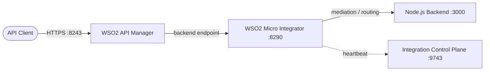

# WSO2 API Manager + Micro Integrator (combined stack)

Combined **WSO2 API Manager (APIM) + WSO2 Micro Integrator (MI)** stack with a sample **Node.js backend API**, wired together on a single Docker network. This mirrors the **IBM API Connect + DataPower** model: APIM is the API management/gateway entry point, MI is the integration and mediation layer, and the Node app is the real backend.



```text
Client --> APIM Gateway :8243 --> MI :8290 --> Node.js app :3000
```

## Components

| Service | Image / Build | Purpose |
|---------|--------------|---------|
| `wso2-am` | `wso2/wso2am:4.7.0` | API management platform + API gateway (entry point) |
| `wso2-mi` | `wso2/wso2mi:4.5.0` | Integration / mediation runtime |
| `wso2-icp` | `wso2/wso2-integration-control-plane:1.0.0` | MI management dashboard |
| `app` | `./app` (Node.js 20) | Sample backend REST API (orders) |

## Docker ports

| Port | Service | Protocol | Purpose |
|------|---------|----------|---------|
| `8243` | wso2-am | HTTPS | API Gateway |
| `9443` | wso2-am | HTTPS | Publisher / Developer Portal / Admin (`admin`/`admin`) |
| `8290` | wso2-mi | HTTP | Integration / API endpoint |
| `8253` | wso2-mi | HTTPS | Secure integration / API endpoint |
| `9164` | wso2-mi | TCP | Management / JMX-related services |
| `9743` | wso2-icp | HTTPS | Integration Control Plane dashboard |
| `3000` | app | HTTP | Node.js backend (also reachable in-network at `http://app:3000`) |

## Directory layout

```text
wso2-am-mi/
├── docker-compose.yml
├── README.md
├── conf/
│   ├── am/
│   │   └── deployment.toml        # APIM config (full default)
│   └── mi/
│       └── deployment.toml        # MI config (base + dashboard)
├── artifacts/
│   └── api/
│       └── OrderAPI.xml           # MI REST API routing to the Node app
└── app/
    ├── Dockerfile                 # Node.js 20 image
    ├── package.json
    ├── server.js                  # Express orders API on :3000
    ├── openapi.yaml               # OpenAPI 3.0 spec of the orders API (import into APIM)
    └── openapi.json               # JSON variant of the same spec
```

## How to run

```bash
docker compose up -d
```

First start pulls several large WSO2 images and builds the Node app, so allow a few minutes. Verify:

```bash
docker compose ps
docker compose logs -f
```

## How to use

### 1. Open the dashboards

- **APIM Publisher:** <https://localhost:9443/publisher> (`admin`/`admin`)
- **APIM Developer Portal:** <https://localhost:9443/devportal>
- **MI Integration Control Plane:** <https://localhost:9743/>

### 2. Test the backend directly

```bash
curl http://localhost:3000/health
curl http://localhost:3000/api/orders
curl http://localhost:3000/api/orders/1
```

### 3. Test through the Micro Integrator

The `OrderAPI` artifact (mounted into `wso2-mi`) exposes `/orders` on the integration port and forwards to the Node app:

```bash
curl http://localhost:8290/orders        # -> Node app /api/orders
curl http://localhost:8290/orders/2      # -> Node app /api/orders/2
```

### 4. Test through the API Manager (full end-to-end)

APIM is the entry point for API consumers. Expose the MI-backed integration as a managed API by importing the OpenAPI spec (`app/openapi.yaml`, generated from `app/server.js`) into the Publisher.

#### How path mapping works

APIM **strips the API context and version** from the request and forwards only the **resource path** to the backend endpoint. Because MI's `OrderAPI` context is `/orders`, the OpenAPI resource paths are written to match it exactly:

| Gateway URL (context + version + resource) | Forwarded to MI | Node backend |
|---|---|---|
| `https://localhost:8243/orders/1.0.0/orders` | `/orders` | `/api/orders` |
| `https://localhost:8243/orders/1.0.0/orders/2` | `/orders/2` | `/api/orders/2` |
| `https://localhost:8243/orders/1.0.0/health` | `/health` | *(no MI route → 404)* |

#### Step-by-step

1. **Open the Publisher**

   <https://localhost:9443/publisher> — login with `admin`/`admin`.

2. **Create the API from the OpenAPI file**

   Click **Create API** → **Import OpenAPI** → upload `app/openapi.yaml`.

   The spec's `x-wso2-*` vendor extensions pre-fill:
   - Name: `OrderAPI` (from `info.title`), Version: `1.0.0` (from `info.version`)
   - Context: `/orders` (from `x-wso2-basePath`)
   - Production/Sandbox endpoint: `http://wso2-mi:8290` (from `x-wso2-production-endpoints` / `x-wso2-sandbox-endpoints`)
   - Resources: `GET /orders`, `GET /orders/{id}`, `GET /health` (from `paths`)

   Review and confirm the values, then click **Create**.

3. **Verify the backend endpoint**

   In the API designer, go to **Runtime Configurations → Endpoint** (or **Endpoints**) and confirm the **Production** endpoint is:

   ```text
   http://wso2-mi:8290
   ```

   (Sandbox can use the same value for this local demo.) Save.

4. **Deploy to the gateway**

   Click **Deploy** → select the **Default** gateway → **Deploy**. This creates a revision and pushes it to the gateway.

5. **Publish**

   Click **Publish** to change the lifecycle state to **PUBLISHED**. The API now appears in the Developer Portal.

6. **Verify in the Developer Portal**

   <https://localhost:9443/devportal/apis> → **OrderAPI** is listed.

7. **Subscribe and get an access token**

   Published APIs require an application credential. In the Developer Portal:
   - Create an **Application** (e.g. `OrderApp`).
   - Open the app → **Subscriptions** → **Subscribe** to `OrderAPI`.
   - **Production Keys** → **Generate Keys** (enable the `client_credentials` grant type).

   Then exchange the consumer key/secret for an access token:

   ```bash
   TOKEN=$(curl -sk -u <CONSUMER_KEY>:<CONSUMER_SECRET> \
     -d "grant_type=client_credentials" \
     https://localhost:9443/oauth2/token | python -c "import sys,json;print(json.load(sys.stdin)['access_token'])")
   ```

   *Note: the API-Key flow is enabled but the OAuth token above is the verified path in this setup.*

8. **Invoke through the gateway**

   ```bash
   curl -k -H "Authorization: Bearer $TOKEN" https://localhost:8243/orders/1.0.0/orders
   curl -k -H "Authorization: Bearer $TOKEN" https://localhost:8243/orders/1.0.0/orders/2
   curl -k -H "Authorization: Bearer $TOKEN" https://localhost:8243/orders/1.0.0/orders/999   # -> 404
   ```

   The full path is then: `Client -> APIM Gateway :8243 -> MI :8290 -> Node.js app :3000`.

> **Note:** `GET /health` is only served by the Node app directly (`http://localhost:3000/health`). MI's `OrderAPI` does not expose it, so that resource returns `404` through the gateway. Add a matching `/health` API to the MI artifact if you need it there.

## Configuration

### Micro Integrator (`conf/mi/deployment.toml`)

```toml
[server]
hostname = "localhost"

[user_store]
type = "read_only_ldap"

[keystore.primary]
file_name = "repository/resources/security/wso2carbon.jks"
password = "wso2carbon"
alias = "wso2carbon"
key_password = "wso2carbon"

[truststore]
file_name = "repository/resources/security/client-truststore.jks"
password = "wso2carbon"
alias = "symmetric.key.value"
algorithm = "AES"

[dashboard_config]
dashboard_url = "https://wso2-icp:9743/dashboard/api/"
heartbeat_interval = 5
group_id = "mi_dev"
node_id = "mi_node_1"
```

- `dashboard_url` uses the compose service name `wso2-icp` so MI can reach the dashboard on the internal network.
- The base sections (`[server]`, `[user_store]`, `[keystore.primary]`, `[truststore]`) are required — the config mapper crashes if they are missing (see Troubleshooting).

### API Manager (`conf/am/deployment.toml`)

Full APIM 4.7.0 default configuration (`[server]`, `[super_admin]`, databases, `[keystore.tls]`, `[apim.gateway]`, etc.). It is the complete file shipped with the product — keep it intact and add your overrides (e.g. `[keystore.tls]` for a custom TLS certificate, see the [wso2-am TLS guide](../wso2-am/README.md#use-a-cloudflare-origin-certificate-for-tls)).

## Node.js backend (`app/`)

Express API returning a hardcoded orders collection, built into a `node:20-alpine` image. On the compose network the Node app is `app:3000`, which is what the MI `OrderAPI` artifact targets:

```xml
<address uri="http://app:3000/api/orders/{uri.var.id}"/>
```

Extend `server.js` or add more services to simulate a real backend.

## Useful commands

```bash
docker compose ps                    # container status
docker compose logs -f               # follow all logs
docker compose logs -f wso2-mi       # MI logs only
docker compose logs -f wso2-am       # APIM logs only
docker compose restart wso2-mi       # restart after artifact/config changes
docker compose down                  # stop and remove
docker compose down -v               # stop, remove, wipe DBs
```

## Troubleshooting

**MI keeps restarting with `Configuration with key server.hostname doesn't exist`**

The mounted `deployment.toml` must include the base sections. Do not override with only a subsection (e.g. only `[dashboard_config]`). The provided `conf/mi/deployment.toml` already contains the full base config — restore it if modified, then recreate:

```bash
docker compose up -d --force-recreate wso2-mi
```

**APIM fails with missing keystore/truststore passwords**

The APIM `deployment.toml` must define `[keystore.tls]`, `[truststore]`, `[user_store]`, `[database.apim_db]`, `[database.shared_db]`, and `[super_admin]`. The provided `conf/am/deployment.toml` is the full product default and includes all of them — keep it complete.

## Related stacks

- [wso2-am](../wso2-am/) — standalone API Manager (includes APIM ↔ MI integration and TLS guides)
- [wso2-mi](../wso2-mi/) — standalone Micro Integrator (includes TLS and backend guides)