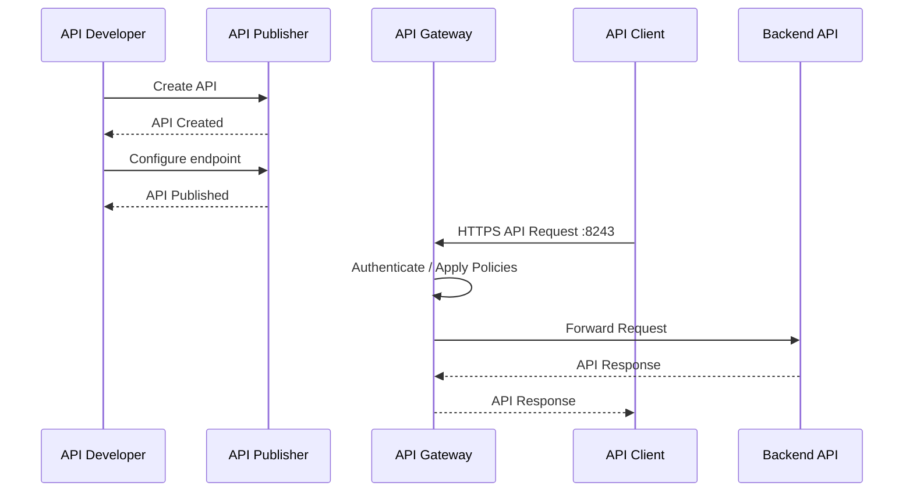
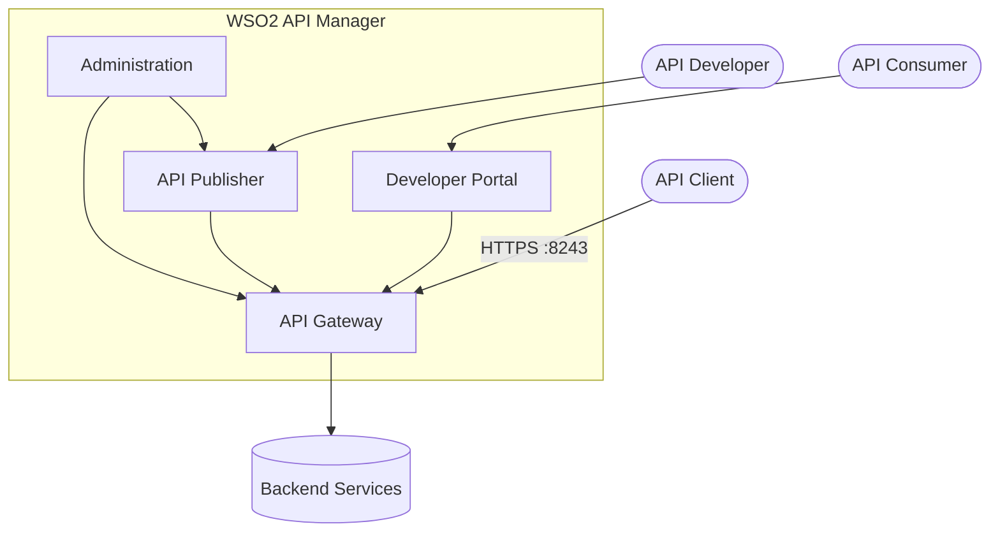

# WSO2 API Manager

WSO2 API Manager (APIM) is an enterprise API management platform for designing, publishing, securing, managing, and consuming APIs.
It provides an API management control plane together with an API gateway for handling API traffic, policies, authentication, subscriptions, and routing.

## How it works




1. API developers create and manage APIs through the **API Publisher**.
2. APIs can be published to the **Developer Portal**, where consumers can discover and subscribe to them.
3. API clients send requests through the **API Gateway** on port `8243`.
4. The gateway applies authentication, authorization, throttling, mediation, and other policies before forwarding requests to the backend.
5. The backend response passes back through the gateway to the API client.

## Stack details in this repo

- Image: `wso2/wso2am:4.7.0`
- Container: `wso2am`
- Gateway HTTPS: `https://localhost:8243`
- Management HTTPS: `https://localhost:9443`
- API Publisher: `https://localhost:9443/publisher`
- Developer Portal: `https://localhost:9443/devportal`
- Admin interface: `https://localhost:9443/admin`
- Default credentials:
  - Username: `admin`
  - Password: `admin`

### Docker ports

| Port | Protocol | Purpose |
|------|----------|---------|
| `8243` | HTTPS | API Gateway |
| `9443` | HTTPS | Management / API-M applications |

## Environment variables

This local setup uses the default WSO2 API Manager configuration and does not require additional environment variables.

| Variable | Default | Description |
|----------|---------|-------------|
| — | — | Uses the default WSO2 APIM configuration |

For production deployments, credentials, certificates, databases, and other configuration should be externalized rather than relying on the development defaults.

## How to run

From the repository root:

```bash
docker compose up -d
```

Check the container:

```bash
docker compose ps
```

Follow the WSO2 logs:

```bash
docker compose logs -f
```

Open the API Publisher:

```text
https://localhost:9443/publisher
```

Open the Developer Portal:

```text
https://localhost:9443/devportal
```

The gateway can be tested with:

```bash
curl -k https://localhost:8243
```

Useful commands:

```bash
docker compose ps
docker compose logs -f
docker compose restart
docker compose down
docker compose down -v
```

## How to use

### Access API Publisher

Open:

```text
https://localhost:9443/publisher
```

Login with:

```text
Username: admin
Password: admin
```

The Publisher is used to:

- Create APIs
- Configure backend endpoints
- Define API resources
- Configure authentication
- Configure throttling policies
- Publish APIs
- Manage API lifecycle and versions

### Create an API

From the Publisher:

```text
Publisher
   |
   +-- Create API
          |
          +-- API Name
          +-- Version
          +-- Context
          +-- Backend Endpoint
          +-- Resources
```

For example:

```text
API Name: Products API
Version: 1.0.0
Context: /products
Backend: http://host.docker.internal:3000
```

The API can then expose resources such as:

```text
GET /products
GET /products/{id}
POST /products
```

### API Gateway flow

Once published, an API request follows the gateway path:

```text
Client
   |
   | HTTPS
   v
localhost:8243
   |
   v
WSO2 API Gateway
   |
   | Authentication
   | Authorization
   | Throttling
   | Policies
   | Routing
   v
Backend API
```

For example:

```bash
curl -k https://localhost:8243/products
```

The gateway receives the request and routes it to the configured backend endpoint.

### Developer Portal

Open:

```text
https://localhost:9443/devportal
```

The Developer Portal allows API consumers to:

- Discover APIs
- View API documentation
- Subscribe to APIs
- Create applications
- Obtain credentials
- Test APIs

## Architecture



## Notes

- `9443` is the HTTPS management/application port. Accessing `https://localhost:9443/` directly may return `404`; use `/publisher`, `/devportal`, or other application paths instead.
- `8243` is the HTTPS API Gateway port.
- The default `admin/admin` credentials are suitable for local development only.
- The HTTPS certificate is typically self-signed in a local installation, so `curl` may require `-k`.
- When the backend runs directly on the Windows host while WSO2 runs inside Docker, `host.docker.internal` can be used to reach the host from the container.
- For production deployments, configure proper certificates, external databases, secrets, identity providers, clustering, persistence, and security policies.
- WSO2 API Manager is an **API management platform**, not merely an API gateway. The gateway handles runtime API traffic while the management components handle API lifecycle, publishing, subscriptions, policies, and developer consumption.
